# 支持Rust语言的源代码级操作系统调试工具

## 摘要

方便的源代码级调试工具，对监测程序运行状态和调试程序十分重要，尤其是复杂的内核代码。然而，目前Rust语言的操作系统开发缺少一款源代码级调试工具，导致相关操作系统实验环境搭建成本高，上手难度大，不利于Rust操作系统的学习与开发。

针对这一需求，本工作开发了一款支持Rust语言的操作系统开发的源代码级调试工具。该工具具备如下特征（1）基于QEMU和GDB，支持跨内核态和用户态的源代码跟踪调试；（2）基于eBPF，支持开发板上跨内核态和用户态的性能分析检测；（3）基于VScode构建了远程开发环境，支持断点调试与性能检测的功能结合。

## 1 概述

### 1.1 研究背景和意义

内核代码的调试难度大通常是阻碍开发人员进行操作系统功能开发的重要因素。由于操作系统内核代码复杂，静态分析、动态分析都具有相当的难度，包括特权级切换，进程调度，页表管理等。已有的集成开发环境通常面向应用程序的开发，对操作系统代码特别是新兴的Rust操作系统代码开发调试暂未提供良好的支持。如何提供方便、高效且可跨特权级跟踪的操作系统调试工具是待解决的关键问题。为了解决该问题，本工作将GDB与eBPF结合，通过远程访问的形式，提供方便的Qemu与实际硬件环境的Rust操作系统的开发与调试。实现用户态、内核态代码的静态断点调试与动态跟踪调试结合，提供了基于VSCode插件的用户交互界面。

我们主要解决以下三个关键问题：

(1) 支持基于GDB的内核态，用户态代码联合断点调试；

(2) 基于eBPF的内核态，用户态代码的动态跟踪调试；

(3) 远程开发环境下的用户界面（集成开发环境）支持与qemu，实际硬件（部分完成）的支持。

在去年的操作系统功能赛道中，本工作已经实现（1）中部分功能，即内核态与0号用户进程的联合断点调试，在今年的工作中，我们在上述基础上进一步实现了内核态与不同用户进程的联合断点调试，并完善了特权级切换功能，具体请见第二节内容。除此之外，（2）中的技术问题已基本实现，具体请见第三节内容，而（3）中关于实际硬件的支持由于时间关系只做了部分的尝试，目前只能完整支持基于Qemu的开发环境，具体请见第四节内容。此外，本工作基于已实现的调试器完成了一个HTTP网页应用的调试，并成功定位到一个疑难问题，具体请见第五节内容。

本工作涉及到多个代码仓库，列表如下：

| 仓库名                    | 仓库描述                                                     | Github 地址                                                 | commit数量（2022年8月至今）                   |
| ------------------------- | ------------------------------------------------------------ | ----------------------------------------------------------- | --------------------------------------------- |
| code-debug                | 本仓库                                                       | <https://github.com/chenzhiy2001/code-debug>                | 124                                           |
| ruprobes                  | 我们移植的uprobe模块和详细的移植文档                         | <https://github.com/chenzhiy2001/ruprobes>                  | 5                                             |
| rcore-ebpf(全小写)        | 整合了ebpf,kprobe,uprobe模块的rCore-Tutorial-v3              | <https://github.com/chenzhiy2001/rcore-ebpf>                | 8                                             |
| uCore-Tutorial-Test-2022A | rcore-ebpf的C程序支持                                        | <https://github.com/chenzhiy2001/uCore-Tutorial-Test-2022A> | 2                                             |
| trap_context_riscv        | trap_context crate （用于uprobe移植）                        | <https://github.com/chenzhiy2001/trap_context_riscv>        | 5                                             |
| rCore-Tutorial-v3         | 修改版rCore-Tutorial-v3，主要包括多个实验分支的调试器部分功能适配，以及main分支的调试器全功能适配 | <https://github.com/chenzhiy2001/rCore-Tutorial-v3>         | 2                                             |
| qemu-system-riscv64       | 修改版的Qemu虚拟机                                           | <https://github.com/chenzhiy2001/qemu-system-riscv64>       | 1（关于我们对Qemu做的修改，可以看3.3.2节）    |
| rustsbi-qemu              | 修改版的RustSBI                                              | <https://github.com/chenzhiy2001/rustsbi-qemu>              | 1（关于我们对RustSBI做的修改，可以看3.3.2节） |
| code-debug-doc            | 旧文档仓库，记录了6月之前的工作                              | <https://github.com/chenzhiy2001/code-debug-doc>            | 13                                            |

### 1.2 工作内容概要

我们的工作主要解决了 Rust 操作系统的跨特权级调试跟踪，和静态动态调试相结合的问题。在解决这些问题的过程中，我们主要实现了以下几个技术：

1. “断点组切换” 机制。在去年的操作系统功能赛上，我们实现了“断点组机制“的一个演示性的版本，当时它仅有一个简单的框架，还不具备实用性。在去年工作的基础上，我们结构化代码，修补了大量漏洞，增添部分实用功能，构建了全新的”断点组切换“用户界面，还整理了一份详细，实用的用户文档（已经有多位同学和老师根据文档配置好了调试器），将所有硬编码的代码都替换为可配置的参数，还在 rCore-Tutorial-v3 之外，支持了一个新的OS（北京理工大学 Alien 队的 Alien OS），从而使得GDB可以方便、稳定地同时跟踪内核态和用户态代码；
2. 在常用教学操作系统 rCore-Tutorial-v3 中支持 eBPF 技术，移植 kprobe 模块和 eBPF 虚拟机模块，基于另一个 OS 的紧耦合的 uprobe 代码编写了一个模块化的 uprobes 模块并移植到 rCore-Tutorial-v3 上，从而内核和应用程序代码都可以用 eBPF 技术进行动态调试；

3. 将 eBPF 技术和 GDB 调试相结合，使得用户可以同时使用两种技术跟踪调试同一个OS。我们利用 GDB 的 Python 脚本功能，扩展原有的 GDB/RSP 协议，让一个GDB同时连接、控制两个 GDBServer（Qemu 提供的 GDBStub 和我们编写的基于 eBPF 技术的 eBPF Daemon），从而使得对两个调试技术的控制统一于一处；

4. 提供完整的图形化界面和自动化功能，使得用户在调试的过程中不需要输入任何终端命令。

### 1.3 本文组织架构

第一章是引言部分，分析了本项目的研究背景和意义，介绍了本项目主要的研究与工作内容。

第二，三，四章分别介绍我们解决的三个关键技术问题。

第五章是利用调试器调试问题的例子。

第六章是总结和展望。

## 2 支持 Rust 操作系统的基于 GDB 的内核态，用户态代码联合断点调试

### 2.1 概述

在代码执行流上，和一般的应用程序相比，操作系统的特点在于频繁的特权级切换。能否跨特权级跟踪操作系统代码的执行（尤其是及用户态、内核态的系统调用交互）是衡量操作系统调试器调试能力的重要指标。然而，如果用户想利用 GDB 同时跟踪内核态和用户态代码，在 GDB 中同时设置内核态和用户态代码的断点，会发现由于特权级切换时页表进行了刷新，地址空间改变，而 GDB 断点又是依赖于地址空间的，所以内核态，用户态 GDB 断点无法全部生效。因此，原生 GDB 不具备内核态与用户态方便的切换跟踪功能。

为了让GDB能够同时跟踪内核态和用户态代码，我们设计了一套名为“断点组切换”的机制，其核心的原理是，将用户设置的GDB断点按断点所在的地址空间分为若干组，在任意时刻下，只有当前地址空间对应的断点组是生效的。如果调试器检测到地址空间发生了切换，就会令 GDB 立即切换到切换后的地址空间对应的断点组和符号表，从而使得在任意时刻下，GDB 都只设置当前运行的指令所在的地址空间的断点，这样就避免了断点失效的问题，保证了用户设置的用户态，内核态的断点均可生效。

实现这套机制的难点在于，地址空间切换后，断点组要立即进行切换，然而 GDB 又如何检测到地址空间是否切换？而且，GDB 只有在断点触发，被调试OS因断点触发而暂停之后，才可以进行断点设置、符号表切换等工作（即 GDB 在大部分情况下进行的都是静态调试），而 OS 的运行又是动态的，瞬息万变的，那么又如何进行断点组，符号表的动态切换？我们将在本章中详细讨论这些问题，以及“断点组切换”机制具体的代码实现。

### 2.2 基于 Debug Adapter 的调试工具设计与实现

如前文所述，我们通过断点组和符号表的动态切换来保证内核态，用户态断点均能正确触发。然而，我们在实现”断点组切换“机制时发现，如果想通过修改 GDB 源代码的方式来实现这种灵活的切换机制，不仅修改 GDB 源码的工作量很大，而且 GDB 和 VSCode 代码编辑器的交互（我们最终的目的是想在VSCode等集成开发环境里用 GUI 进行OS调试）也要从头编写。因此我们查找资料，想寻找一种更高效的”断点组切换“实现方式。我们发现，在 VSCode 上，VSCode 一般并不直接和各种调试器进行信息传输和控制交互，而是通过一个叫调试适配器（Debug Adapter, DA）的 ”中间人“ 将不同调试器提供的不同接口协议（比如，GDB 提供的 GDB/MI 接口和 LLDB 提供的 LLDB/MI 接口）都通过 Debug Adapter 抽象成统一的调试适配器协议（Debug Adapter Protocol, DAP），而 VSCode 已经完整支持调试适配器协议，还基于调试适配器协议，实现了一个原生的，非语言相关的调试器UI，所以开发者只需要以 VSCode 插件的形式实现一个能和自己的调试器进行交互的调试适配器，并且将调试适配器对接到 VSCode 就可以了。

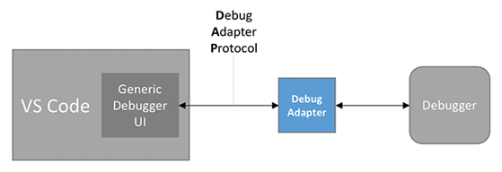

<div align='center'>图2.1 基于Debug Adapter的调试架构</div>

在研究了调试适配器协议和GDB的 GDB/MI 接口后，我们认为，编写一个对下通过 GDB/MI 接口控制 GDB，对上通过 DAP 协议和 VSCode 调试界面进行交互的调试适配器，不仅能实现我们的”断点组切换“功能，而且代码抽象层次高，实现后续各种功能（包括对用户界面的扩展，对 eBPF 的支持等）都比较高效。于是，我们采用了这种实现方案，在Debug Adapter中实现”断点组切换“。

### 2.3 解决内核态用户态的 GDB 断点冲突

前面已经讲到，要实现操作系统调试功能的关键问题在于同时设置内核态、用户态的断点，但是我们在 rCore-Tutorial-v3 操作系统上实际测试后发现，用户态、内核态的断点设置是冲突的。这是由于 GDB 根据内存地址设置断点，因此是依赖于页表、快表的，但是 rCore-Tutorial-v3 从内核态切换到用户态时执行了 risc-v 处理器的`sfence.vma`等指令，使得 TLB 刷新成用户进程的页表。所以，如果在 rCore-Tutorial-v3 操作系统运行在内核态时，令 GDB 设置用户态程序的断点，这个用户态的断点无法被触发。

解决这个问题的核心思路是，缓存设置后会造成异常情况的断点，待时机合适再令 GDB 设置这些断点。在用户态运行时，缓存内核态断点；在内核态运行时，缓存用户态断点。为此，我们在 Debug Adapter 中新增了一个断点组管理模块。

断点组管理模块用一个词典缓存了用户要求设置的（包括内核态和用户态）所有断点。词典中某个元素的键是内存地址空间的代号，元素的值是这个代号对应的断点组，即这个内存地址空间里的所有断点。当任何一个断点被触发时，Debug Adapter 都会检测当前触发的这个断点属于哪个断点组。我们将这些包含了最新触发断点的断点组称为当前断点组（Current Breakpoint Group）。

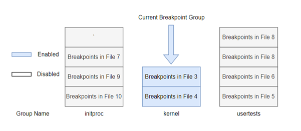

<div align='center'>图2.2  断点组</div>

如上一节所述，我们通过 Debug Adapter 来实现这个机制。Debug Adapter 和 GDB 的交互比较简单，我们只要实现以下四个功能即可：

1. Debug Adapter 通过向 GDB 发送 `set-breakpoint` 设置一个断点，GDB 返回断点设置的结果。
2. Debug Adapter 通过向 GDB 发送 `add-symbol-file` 添加符号表，GDB 返回符号表添加的结果。
3. Debug Adapter 通过向 GDB 发送 `remove-breakpoint` 去除一个断点，GDB 返回断点去除的结果。
4. Debug Adapter 通过向 GDB 发送 `remove-symbol-file` 去除符号表，GDB 返回去除的结果。

然而，Debug Adaper 和 VSCode 的交互略显复杂。Debug Adapter 和 VSCode 用调试适配器协议进行交互，该协议主要由以下三个部分组成：

1. Events 定义了调试过程中可能发生的事件；
2. Requests 定义了VSCode等调试器UI对Debug Adapter的请求；
3. Responds 定义了Debug Adapter对请求的回应。

当用户在 VSCode 编辑器中设置新断点时，VSCode 会向Debug Adapter 发送一个请求设置断点的 Request：

```typescript
   onDidSendMessage: (message) => {
        if (message.command === "setBreakpoints"){
//如果Debug Adapter设置了一个断点
            vscode.debug.activeDebugSession?.customRequest("update");
        }
        if (message.type === "event") {
            //如果（因为断点等）停下
            if (message.event === "stopped") {
                //更新寄存器和断点信息
                vscode.debug.activeDebugSession?.customRequest("update");  
            }
```

Debug Adapter 中的断点组管理模块会先将这个断点的信息存储在对应的断点组中，然后判断这个断点所在的断点组是不是当前断点组，如果是的话，就令 GDB 当即设置这个断点。反之，如果不是，那么这个断点暂时不会令 GDB 设置（由于API名比较冗长，为了不占用过多篇幅，我们用截图来展示这份关键代码）：

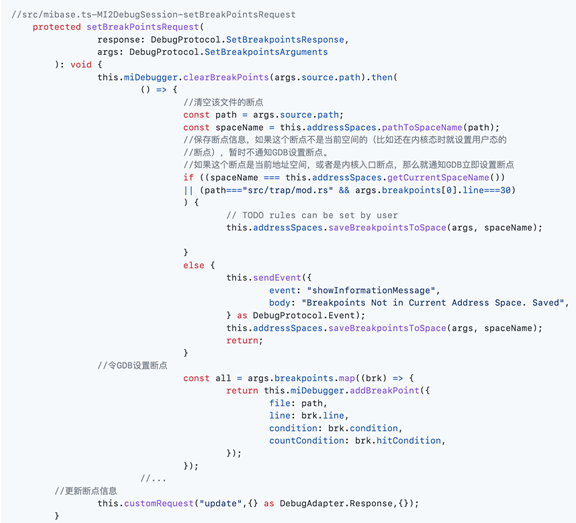

<div align='center'>图2.3  断点组缓存代码</div>

在这样的缓存机制下，GDB 不会同时设置内核态和用户态断点，因此避免了内核态用户态的断点冲突。接下来需要一个机制，在合适的时机进行断点组的切换，保证某个断点在可能被触发之前就令 GDB 设置下去。显然，**利用特权级切换的时机是理想的选择**。因此，我们令Debug Adapter 自动在内核态进入用户态以及用户态返回内核态处，设置断点。我们称这两个断点为**边界断点**。如果边界断点被触发，就意味着特权级发生了切换，进而内存地址空间也会发生切换，因此断点组也应当切换。我们令 Debug Adapter 每次断点被触发时都检测这个断点是否是边界断点。如果是的话，先移除旧断点组中的所有断点，再设置新断点组的断点（图2.4）：


<div align='center'>图2.4  断点组切换</div>

断点组切换的代码如下：

```typescript
  protected handleBreakpoint(info: MINode) {
        if (this.addressSpaces.pathToSpaceName(
info.outOfBandRecord[0].output[3][1][4][1])
==='kernel'
){//如果是内核即将trap入用户态处的断点
            this.addressSpaces.updateCurrentSpace('kernel');
            this.sendEvent({ event: "inKernel" } as DebugProtocol.Event);
            if (info.outOfBandRecord[0].output[3][1][3][1] === "src/trap/mod.rs"
&& info.outOfBandRecord[0].output[3][1][5][1] === '135') {
                this.sendEvent({ event: "kernelToUserBorder" }
 as DebugProtocol.Event);//发送event
            }
        }
    }
```

为了保证相关功能正常运作，断点组切换时，符号表文件也应随着断点组的切换而切换：

```typescript
//extension.ts   
else if (message.event === "kernelToUserBorder") {
    //到达内核态->用户态的边界
    // removeAllCliBreakpoints();
    vscode.window.showInformationMessage("will switched to " + userDebugFile + " breakpoints");
    vscode.debug.activeDebugSession?.customRequest("addDebugFile", {
        debugFilepath:
            os.homedir() +
            "/rCore-Tutorial-v3/user/target/riscv64gc-unknown-none-elf/release/" +
            userDebugFile,
    });
    vscode.debug.activeDebugSession?.customRequest(
        "updateCurrentSpace",
        "src/bin/" + userDebugFile + ".rs"
    );
```

目前，rCore-Tutorial-v3 的主线版本只支持在单核处理器上运行，因此我们没有做多核处理器的适配工作。不过，从调试工具的角度来讲，多核处理器的适配是比较简单的，只需要根据进程的CPU号进行断点组的细分即可。

### 2.4 获取更多调试信息

上一章所述的”断点组切换“机制用到了两个关键的”边界断点“。然而，在使用默认编译参数的情况下，rCore-Tutorial-v3 使用的 rustc 编译器会对代码进行比较激进的优化，例如内联函数，删除大量有助于调试的符号信息等，导致边界断点无法设置。因此，如果不修改编译参数，rCore-Tutorial-v3 编译出的操作系统镜像和调试信息文件就难以用于基于”断点组切换“机制的操作系统调试。因此，我们需要修改编译参数，以尽量避免编译器的优化操作。

rCore-Tutorial-v3 是用 cargo 工具创建的。一般而言，用 cargo 工具创建的 rust 项目可用release, debug 两种模式编译、运行。在这两种模式中， release 模式对代码进行较高等级的优化，删除较多调试相关的信息，而 debug 模式则对代码进行较弱等级的优化并保留了更多调试相关的信息，比较符合我们的需求。但是由于 rCore-Tutorial-v3 项目本身的设计缺陷，这个项目不支持使用 debug 模式进行编译。因此，我们修改了 release 模式的配置文件，让编译器在 release 模式下也像在 debug 模式下一样关闭代码优化，保留调试信息。

此外，rCore-Tutorial-v3 为了提升性能，修改了用户态程序的链接脚本，使得 .debug_info 等包含调试信息的DWARF 段[4]在链接时被忽略。这些段对调试用户态程序非常重要，因此我们也修改了链接脚本，移除这种忽略。在修改了链接脚本后，为了让链接脚本生效，需要用 cargo clean 命令清空缓存。

在修改了编译参数、链接脚本后，编译出的可执行文件占用的磁盘空间显著增加，导致 rCore-Tutorial-v3 操作系统的 easy-fs 文件系统无法正常运作，例如在加载文件时崩溃，栈溢出等。为了解决这个问题，我们调整了这个文件系统的 easy-fs-fuse 磁盘打包程序的磁盘大小等参数。此外，由于可执行文件中保留了大量符号信息，用户程序在运行时占用的内存也显著增加，我们也调整了操作系统的用户堆栈大小和内核堆栈大小。

我们将这些对于配置文件、链接脚本、操作系统源代码的修改整理成一个 diff 文件，用户只需要在远程终端中通过 git 应用这个 diff 文件即可完成上述修改。我们同时也维护一个已经修改好的 rCore-Tutorial-v3 GitHub 仓库供用户直接下载使用。

### 2.5 扩大调试器的适用面

以上所述内容是去年的主要工作，今年我们在去年工作的基础上大大提升了基于 GDB 的操作系统调试器的实用性和适用面。主要工作有：

1. 将所有硬编码内容替换为可配置的参数，使调试器更容易适配其他OS；
2. 修补“断点组切换”代码的漏洞，在rCore-Tutorial-v3的进程控制块中添加进程名，从而稳定支持多个进程的切换跟踪；
3. 编写可行、可读的调试器配置文档；
4. 适配另一个OS:  Alien OS；
5. 改进界面。

## 3 解决 Rust 操作系统中基于 eBPF 的内核态，用户态代码的动态跟踪调试

### 3.1 概述

在实现了基于 GDB 的内核态与用户态方便的切换跟踪后，我们发现了这套调试工具的局限性。比如，为了获取足够多的调试信息，我们不得不修改编译参数，从而取消内联，并且保留符号表（见 2.4 节）。这样的做法会导致内核和应用程序占用的内存、磁盘空间成倍增加。如果是在虚拟机上调试操作系统，通过增加虚拟机分配的内存和磁盘空间尚且可以解决这个问题；但是如果是在内存较小的真实硬件上调试操作系统，由于我们无法直接增加硬件的内存大小，OS就会因为调试信息占用过多资源而无法正常运行，这显然是用户无法接受的。

因此，我们需要新的更高效灵活的的获取调试信息的办法。为此，我们在已有的 GDB 跨特权级调试工具的基础上，增加了基于eBPF技术的动态跟踪调试功能。在调试器方面，我们工作的重点是创造一个尽量不影响 OS 运行的调试命令、调试信息传送渠道，而且 eBPF 的调试功能要由GDB来控制，从而使得用户可以同时使用 GDB 断点和 eBPF技术进行调试，调试流程统一于一处；在被调试的操作系统方面，由于我们想调试的rCore-Tutorial-v3操作系统的主线版本暂不支持eBPF，我们移植了现有的kprobe模块和eBPF虚拟机，并且将另一个 OS 的紧耦合的 uprobe 代码改写成一个独立的 Rust 模块（crate），并且移植到 rCore-Tutorial-v3 中 ，还提供了详细的移植文档[8]，方便其他同学将我们编写的 uprobe 模块移植到更多 OS 中。

有了基于 eBPF 的内核态，用户态代码的动态跟踪调试功能后，用户可以有更灵活的动态调试策略，获取更多样的调试信息，且调试本身对OS运行状态的影响降到最低（这有益于获取和运行时间相关的信息）。在硬件资源有限，不能修改编译参数的情况下，也能获取足量调试信息。

接下来，我们先介绍 rCore-Tutorial-v3 上的 eBPF 移植过程，再讨论如何将 eBPF 调试功能对接到VSCode编辑器上。

### 3.2 在 rCore-Tutorial-v3 上实现 eBPF 功能

#### 3.2.1 概述

扩展伯克利包过滤器（extended Berkeley Packet Filter，简称 eBPF）是一个允许在内核里安全地执行不受信任的用户代码的子系统。它依赖于静态分析来保护内核免受有漏洞的、恶意的代码的破坏， 因此，eBPF程序很适合用于各种复杂的监控，调试场景。

一个eBPF系统主要包含eBPF虚拟机（用于执行eBPF字节码）、kprobe（用于监控内核指令和内核函数），uprobe（用于监控用户程序执行和函数），verifier（用于验证即将执行的eBPF字节码是否安全）。目前，主线版本的 rCore-Tutorial-v3 尚未支持 eBPF，但是在 rCore-Tutorial-Code-2022A ( rCore-Tutorial-v3 的课堂教学版本) 上，已经有了 eBPF 虚拟机模块和kprobe模块，我们将这两个模块移植到了 rCore-Tutorial-v3 上。由于 rCore-Tutorial-v3 上暂时没有成熟可用 uprobe 模块，我们将 [rCore-eBPF项目](https://github.com/hm1229/rCore-ebpf) ( 该项目基于一个早期的，大规模的，代码实现和 rCore-Tutorial-v3 完全不同的 rCore OS，实现了 uprobe 和 kprobe 功能） 中的紧耦合的 uprobe 代码改写成一个独立的模块（Rust Crate）并移植到 rCore-Tutorial-v3 上。由于 rCore-Tutorial-v3 和 rCore 相比，各种功能的实现方式都有很大不同，两个 OS 提供的 API 也不尽相同，甚至，一部分 rCore 的 API 在 rCore-Tutorial-v3 里没有对应的实现，只能我们自己为 rCore-Tutorial-v3 编写。因此，uprobe 模块化和移植的工作量比较大。

#### 3.2.2 将eBPF虚拟机、kprobe移植到 rCore-Tutorial-v3

在移植eBPF虚拟机、kprobe 的过程中，我们遇到的主要障碍是 rCore-Tutorial-v3 的中断处理流程中使用了较新的Trap::Breakpoint模块，而rCore-Tutorial-2022A用的是Trap::Exception模块，需要在这两个模块之间进行转换。

其次，考虑到用户在大部分情况下都是使用函数名，变量名等符号而不是具体的地址来设置断点，eBPF模块需要有将符号转换为地址的功能。rCore-Tutorial-2022A的eBPF模块预留了这个功能的接口但并没有实现，而我们在rCore-Tutorial-v3的eBPF模块中实现了这个功能。

实现符号转地址功能的第一步是获取完整的符号表。在 2.4 节中我们已经详细描述了如何做到在编译、链接时保留符号信息且操作系统仍能正常运行，在此基础上，我们首先通过内嵌汇编的方式，在内核的数据段中分配了3MiB的连续空间用于存放符号表；其次修改用于构建内核的 Makefile 脚本，使得 Makefile 在构建内核后通过调用nm工具从内核镜像中提取内核符号信息并保存为文本文件；最后利用 dd 命令，将符号文件注入到内核镜像中。

需要注意的是，Rust编译器会对函数名进行名字改编（Name Mangling），这会对eBPF模块的符号解析功能造成障碍。在早期版本的Rust工具链中，可以通过添加rustflags = ["-Zsymbol-mangling-version=v0"] 编译参数关闭名字改编；在近期版本的Rust工具链中这个编译参数不再有效，需要用rustfilt工具将保存有内核符号信息的文本文件中的所有被名字改编的符号还原为原本的符号。

在有了完整且可解析的符号表并成功注入内核后，我们编写了一个工具函数用于在符号表中搜索特定的符号并返回符号对应的地址，从而实现了预留的符号解析接口。

#### 3.2.3 uprobe 的模块化和移植工作

##### 3.2.3.1 将紧耦合的 uprobe 代码抽象成独立的模块（crate）

在考虑向 rCore-Tutorial-v3 上移植 uprobe 时，我们意识到应该先进行 uprobe 的模块化工作，再将模块化的 uprobe 移植到 rCore-Tutorial-v3。这样，未来如果想基于eBPF技术调试其他的OS，且这个OS里没有uprobe的话，再次移植的工作量会小很多。

和 kprobe 相比，uprobe 模块化的难点在于 uprobe 会调用和操作系统紧密相关的内核函数，进行进程控制块的读取、页表操作等。对此，我们的解决方案是，将这些和 OS 紧密相关的代码抽象成三个函数，uprobe模块内会调用这三个函数，但是uprobe模块内只有这三个函数的函数签名，而这三个函数的具体代码实现交给内核（通过运用 rust的 `extern C`语法）。这三个函数是：

1. `get_exec_path` ：读取进程控制块中的进程名；
2. `get_new_page`：获取一个新的页，用于存储 trap frame；
3. `set_writeable`：将某一页设为可写。

在 3.2.3.2 节，我们会详细介绍这三个内核函数的实现。

除此之外，我们还需要将一些 rCore 专属的数据结构和不通用的内存读写方式进行抽象，改为比较通用的数据结构和可调整的内存读写方式。

首先，我们发现 rCore-Tutorial-v3 用的 trap-frame 模块和 uprobe 模块用的 trap-frame 版本是不同的，在将版本统一之后，又发现 rCore trap-frame 模块没有保存我们需要的所有寄存器信息，会导致这个 uprobe 模块无法兼容 rCore-Tutorial-v3 上已有的eBPF、kprobe模块。为此，我们基于 rCore-Tutorial-v3 的代码，抽象出了一个比较完整的 [trap_context_riscv](https://github.com/chenzhiy2001/trap_context_riscv) crate，不论是uprobe模块还是 OS 里的 eBPF、kprobe 模块，都统一使用这个完整的 trap-frame 实现，从而解决了这个问题。

其次，我们还改动了一个闭包函数和它相关的函数指针代码。这个闭包函数的名字是`uprobe_handler`，它用于在 uprobe 的观察点（tracepoint）触发之后运行 eBPF程序，从而收集到调试信息。这个闭包函数应该由内核中的eBPF虚拟机模块提供，然后在 uprobe 初始化的时候，将这个函数的指针传入uprobe模块。这个函数的闭包特性导致编译时报错“doesn't have a size known at compile-time”，我们阅读了 Rust 官方文档的相关章节，经过仔细分析，大量尝试，且咨询了这段代码的原作者后发现，使用闭包纯粹是受限于rCore 的代码实现，实际上，对于我们的独立的 uprobe 模块来说，闭包的特性是没有必要的，因此我们去掉了闭包特性，uprobe 初始化的时候仅传入一个普通的带Mutex锁的函数指针，不仅能满足我们的需求，而且大大精简了相关代码的类型定义。

##### 3.2.3.2 将 uprobe 模块移植到 rCore-Tutorial-v3

在做了上一章所述的改动之后，我们完成了一个能通过编译的 uprobe 模块。接下来，我们进入到下一阶段，将 uprobe 模块移植到 rCore-Tutorial-v3。

###### 3.2.3.2.1 get_new_page 函数的实现

get_new_page 函数的作用是获取一个新的页，提供给uprobe模块进行trapframe的读取。这个函数的代码如下，主要的流程是：先获取当前进程（在rCore-eBPF 里，由于OS实现的不同，是先获取当前线程）的独占引用，然后调用`find_free_area`函数找到一个闲置的页，将页的地址返回，作为uprobe ebreak的地址。接着将这个页的信息注册到页表里，最后返回页的地址。

``` rust
#[no_mangle]
pub extern "C" fn get_new_page(addr: usize, len: usize) -> usize{
    //println!("get_new_page");
    let binding = crate::task::current_process();
    // println!("Getting PCB in get_new_page");
    let mut current_proc = binding.inner_exclusive_access();
    let ebreak_addr = current_proc.memory_set.find_free_area(addr, len);
    current_proc.memory_set.push(MapArea::new(ebreak_addr, VirtAddr(ebreak_addr.0+len), Framed, MapPermission::R | MapPermission::W| MapPermission::X| MapPermission::U), None);
    unsafe {asm!("fence.i");}
    ebreak_addr.0
}
```

可以看到，这个函数体本身是比较简单的，但是它调用的`find_free_area`却不是。在rCore中，`find_free_area`是OS自带的一个函数，只需要调用即可，但是在rCore-Tutorial-v3 里是没有类似功能的函数的，需要我们自己实现。

`find_free_area`函数的代码实现如下：

```rust
    /// Find a free area with hint address `addr_hint` and length `len`.
    /// Return the start address of found free area.
    /// Used for mmap.
    pub fn find_free_area(&self, addr_hint: usize, len: usize) -> VirtAddr {
        // brute force:
        // try each area's end address as the start
        super::address::VirtAddr(
            core::iter::once(addr_hint)//czy is this correct?
            //.chain(self.areas.iter().map(|area| area.end_addr))//czy we dont have end_addr. what does this line do? what's an alternative solution?
            //.map(|addr| (addr + PAGE_SIZE - 1) & !(PAGE_SIZE - 1)) // round up a page。
            .chain(self.areas.iter().map(|area|area.vpn_range.get_end().0+PAGE_SIZE))//should we -1?
            .find(|&addr| self.test_free_area(addr, addr + len))
            .expect("failed to find free area ???")
        ) 
    }
}
```

在查阅关于 Rust 函数式编程和链式调用语法的资料后，这段代码的作用也不难理解：用蛮力算法找到一个足够长的连续空闲内存区间。在实现这段代码时，困难的地方在于 rCore-Tutorial-v3 是以页区间为单位管理内存的，而 rCore-eBPF 项目是以地址区间为单位管理内存的（例如，上图中注释掉的两行代码就是来源于rCore-eBPF 项目），所以我们要将以地址区间为单位的内存管理代码转换为以页区间为单位的内存管理代码。

`find_free_area`也调用了一个子程序`test_free_area`（用于测试某个内存区间是否已经被占用），而`test_free_area`又调用了`is_overlap_with`子程序。同样地，这些子程序在 rCore-eBPF 项目中是OS代码提供的现成API，但是在rCore-Tutorial-v3中，需要我们自己实现。

`is_overlap_with`函数功能简单（即测试两个内存区间是否重叠），代码也不长，但是由于文档的缺失（rCore-Tutorial-v3的内存管理是左闭右闭的，而rCore则是左闭右开的，两个OS的文档都没说明确这一点，我们通过自己的实际测试才发现这个问题），加上两个OS的内存管理单位不同（rCore以内存区间为单位，rCore-Tutorial-v3以页区间为单位）这段代码极易出错：

```rust
    /// Test whether this area is (page) overlap with area [`start_addr`, `end_addr`]
    pub fn is_overlap_with(&self, start_addr: VirtAddr, end_addr: VirtAddr) -> bool {
        // original from rCore-ebpf: 
        // let p0 = Page::of_addr(self.start_addr);
        // let p1 = Page::of_addr(self.end_addr - 1) + 1;
        // let p2 = Page::of_addr(start_addr);
        // let p3 = Page::of_addr(end_addr - 1) + 1;
        // if OS crashes, here should be the first place to check with.
        let p0 = self.vpn_range.get_start();
        let p1 = self.vpn_range.get_end();
        let p2 =  start_addr.floor();//VirtPageNum::from(start_addr);
        let p3 = end_addr.ceil();//VirtPageNum::from(end_addr.0+PAGE_SIZE);//Page::of_addr(end_addr - 1) + 1;
        !(p1 < p2 || p0 > p3)
    }
}
```

在重写这个函数至少五次之后，我终于写出了不出错的版本，且彻底了解了rCore-Tutorial-v3 内存管理API的使用，和这段代码的含义：

在正常情况下，如果两个区间[p0,p1),[p2,p3)不重叠，只有两种情况：

1. `p0-p1, p2-p3`
2. `p2-p3, p0-p1`

其中，p0 < p1 和 p2 < p3 这两个条件肯定是满足的，因此只需要检查 p1 与 p2 ，p3 与 p0 的关系。

在第一种情况下，p1<=p2 ；在第二种情况下，p3<=p0。如果这两个情况都不出现，那么就是重叠了。

但是，这种推理方式的前提是，给定的区间都是左闭右开的，而rCore-Tutorial-v3的内存区间相关的数据结构都是闭区间（文档里没明说，我根据代码和自己的实验猜测的）。因此，与其将闭区间转换成左闭右开（这是之前多次写错的根本原因），不如直接改写成闭区间的写法（即，在第一种情况下，p1<p2 ；在第二种情况下，p3<p0。如果这两个情况都不出现，那么就是重叠了），就不会写错了，而且代码简洁不少。

###### 3.2.3.2.2 set_writeable 函数的实现

`set_writeable` 函数的作用是，在`get_new_page` 函数获取到新的页用户空间的页后，需要将这一个页设为可写，从而内核中的 uprobe 模块可以对这个页进行修改。

```rust
// mm/mod.rs

/// only use this for uprobe
#[no_mangle]
pub extern "C" fn set_writeable(addr: usize){
    //println!("set_writable. addr is {:x}",addr);
    let binding = crate::task::current_process();
    // println!("Getting PCB in set_writeable");
    let current_proc = binding.inner_exclusive_access();
    current_proc.memory_set.page_table.translate(VirtAddr(addr).floor()).unwrap().set_writable();
    //println!("setted!");
    unsafe {asm!("fence.i");}
}


// mm/page_table.rs
impl PageTableEntry {
    // ...
    pub fn set_writable(&mut self){
        //println!("before: {:x}",self.bits);
        self.bits |= 0b111;//1<<2 ;
        //println!("after: {:x}",self.bits);
    }
}
```

如以上代码所示，由于 rCore-Tutorial-v3 没有提供将页设为可写的 API，我们自己利用对页表项的位操作编写了一个。然而，在实际测试中，我们发现，即使我们将某一用户空间页的页表项设为可写，内核态的 uprobe 代码还是不能写这个页里的地址（甚至无法读），一旦在内核里读/写这个用户地址，os就会报 loadpagefault 然后退出。而在 rCore-eBPF 中，用同样的方式修改页表项后，相关地址就可以进行读写了。两个OS虽然实现方式有很大不同，但是运行于相同的体系结构，相同版本的虚拟机，怎么会出现这样的情况？我们推测了很多种导致错误的原因，包括页表操作错误，位操作错误，初始化时机不对，页不可读,未对 loadpagefault 做正确处理等，但是经过我们一一验证之后，发现它们都不是导致错误的原因，排查多日后发现，rCore-Tutorial-v3 采用了一种独特的“双页表”设计，即进程和内核使用不同的页表；而在 rCore 中采用的是更普遍的"单页表"设计，即进程和内核共享同一张页表。所以，在 rCore 等"单页表"OS中，内核地址空间中执行的内核代码如果需要读写应用的地址空间中的数据，内核可以直接对用户空间的地址进行方寸，因为一个进程及其内核空间只需花费一个页表；而在 rCore-Tutorial-v3 中，这无法简单的通过一次访存来解决，而是需要手动查用户态应用的地址空间的页表，知道用户态应用的虚地址对应的物理地址后，转换成对应的内核态的虚地址，才能访问应用地址空间中的数据。如果访问应用地址空间中的数据跨了多个页，还需要注意处理地址的边界条件。

进一步查找资料，我们发现，rCore-Tutorial-v3 的 eBPF 虚拟机作者已经意识到了这个问题，且在他的[文档](https://livingshade.github.io/ebpf-doc/rcore/)中提供了两个工具函数，用于“双页表”下的用户内存读写：

``` rust
pub fn os_copy_from_user(usr_addr: usize, kern_buf: *mut u8, len: usize) -> i32 {
    use crate::mm::translated_byte_buffer;
    use crate::task::current_user_token;
    let t = translated_byte_buffer(current_user_token(), usr_addr as *const u8, len);    
    let mut all = vec![];
    for i in t {
        all.extend(i.to_vec());
    }
    copy(kern_buf, all.as_ptr() as *const u8, len);
    0
}

pub fn os_copy_to_user(usr_addr: usize, kern_buf: *const u8, len: usize) -> i32 {
    use crate::mm::translated_byte_buffer;
    use crate::task::current_user_token;
    let dst = translated_byte_buffer(current_user_token(), usr_addr as *const u8, len);
    let mut ptr = kern_buf;
    let mut total_len = len as i32;
    for seg in dst {
        let cur_len = seg.len();
        total_len -= cur_len as i32;
        unsafe {
            core::ptr::copy_nonoverlapping(ptr, seg.as_mut_ptr(), cur_len);
            ptr = ptr.add(cur_len);   
        }
    }
    assert_eq!(total_len, 0);
    0
}

// You don't need to change this two functions
pub fn copy(dst: *mut u8, src: *const u8, len: usize) {
    let from = unsafe { from_raw_parts(src, len) };
    let to = unsafe { from_raw_parts_mut(dst, len) };
    to.copy_from_slice(from);
}

pub fn memcmp(u: *const u8, v: *const u8, len: usize) -> bool {
    return unsafe {
        from_raw_parts(u, len) == from_raw_parts(v, len)
    }
}
```

但是，想要用上这两个工具函数`os_copy_from_user`和`os_copy_to_user`，还需要解决最后一件麻烦事：现有的 uprobe 代码在内存读写这一部分写得比较随便，不容易看明白某段代码的最终目的到底是获取数据还是修改数据。因此，我们需要完整，谨慎地分析代码，判断每一处内存操作是读还是写。对于读操作，创建一个缓冲区，然后调用`os_copy_from_user`向缓冲区内写入数据即可；对于写操作，需要先读取到缓冲区，待uprobe修改了缓冲区的数据后，再利用`os_copy_to_user`将缓冲区内数据写回原处。改写代码时，一定要特别注意原版代码里是否有写操作，防止出现这种情况：对用户内存有修改，但是却只在缓冲区里修改，没有将修改后的数据写回原地址。

###### 3.2.3.2.3 get_exec_path 函数的实现

`get_exec_path`函数用于获取PCB中进程名，但是 rCore-Tutorial-v3 中PCB是不保存进程名的，我们需要加上。这个过程大概分为三个部分：

1. OS创建零号进程`initproc`时，在其PCB内添加上进程名"initproc"；
2. 在`fork()`系统调用中，`fork`出的子进程需要赋予和父进程相同的进程名；
3. 在`exec()`系统调用的代码中，需要修改当前PCB里存储的进程名，因为`exec()`系统调用不会创造新的进程控制块，而是覆盖当前资源，基于当前PCB来运行新程序。

完成以上三步，PCB里就保存了进程名。之后，`get_exec_path`函数只需要获取到当前进程的PCB的独占借用，即可得到需要的进程名：

```rust
/// use this for uprobe
#[no_mangle]
pub extern "C" fn get_exec_path() -> alloc::string::String{
    // get path of current thread
    let my_process = &current_task().unwrap().process;
    let _ = my_process.upgrade().unwrap();
    // println!("Getting PCB in src/task/mod.rs get_exec_path()");
    let ret=my_process.upgrade().unwrap().inner_exclusive_access().path.clone();
    //println!("get_exec_path succeeded. path = {}", ret);
    ret
}
```

然而获取PCB的独占借用也不是一帆风顺的，具体见下一节。

###### 3.2.3.2.4 解决PCB借用失败的问题

在实现了`get_exec_path` 、`get_new_page` 和`set_writeable`这三个和PCB、页表相关的函数后，引入了 uprobe 模块的内核可以通过编译，但是还不能正常启动。我们发现，在OS准备执行initproc进程，uprobe开始初始化时，uprobe 模块总是 panic 然后内核停止运行。panic输出的报错信息是：

```shell
[ERROR] [kernel] Panicked at src/sync/up.rs:111 already borrowed: BorrowMutError
```

由于这个错误信息告知的出错位置是智能指针的代码，而不是智能指针使用者的代码，我们没法找到真正的错误代码的位置。好在，在这种情况下，`println!` 输出宏还是可以正常使用的。通过不断的print尝试，我发现出错的原因是，在OS的fork函数被调用后，fork出来的新进程需要初始化 uprobe，而在初始化 uprobe 的过程中，uprobe 模块通过`get_exec_path`函数读取PCB之前，需要调用`exclusive_access()`方法获取到PCB的独占的引用（即，uprobe模块引用PCB时，没有其他代码也在引用PCB，如果已经有其他代码在引用PCB，就会直接panic退出内核）而PCB在此时已经被其他代码借用了。

对于这个问题，我想到了以下三个解决思路：

1. 考虑到`get_exec_path`获取PCB的独占引用仅仅是为了获取进程名，不会修改PCB，不如将进程名数据复制放到其他允许不独占引用的结构体中。
2. 修改PCB的定义，换用其他智能指针（比如早期版本的rCore-Tutorial-v3中用的`UPSafeCell`）从而允许PCB同时被多者引用
3. 修改内核代码中不同模块的借用顺序， 从而使得各处代码对于PCB的独占借用不冲突，好借好还，再接不难。

如果采用思路1，会发现fork之后进程名的更新成为了麻烦，原因是，会导致进程名更新的代码全部都在这个独占引用结构体的方法里，而独占引用结构体里的函数无法“跳出”独占引用容器，主动访问外部信息。

如果采用思路2，会导致其他代码不可用。rCore-Tutorial-v3 的文档里已经明确解释了为什么换用这个“关中断独占容器”是必要的：

> use `UPSafeCell` instead of `RefCell` or `spin::Mutex` in order to access static data structures and adjust its API so that it cannot be borrowed twice at a time(mention `& .exclusive_access().task[0]` in `run_first_task`) -
>
> -- rCore-Tutorial-v3 Readme

> ...另一方面是提供了 UPIntrFreeCell 接口，代替了之前的 UPSafeCell 。在Device OS 中把 UPSafeCell 改为 UPIntrFreeCell 。这是因为在第九章前，系统设置在S-Mode中屏蔽中断，所以在 S-Mode中运行的内核代码不会被各种外设中断打断，这样在单处理器的前提下，采用 UPSafeCell 来实现对可写数据的独占访问支持是够用的。但在第九章中，系统配置改为在S-Mode中使能中断，所以内核代码在内核执行过程中会被中断打断，无法实现可靠的独占访问。本章引入了新的 UPIntrFreeCell 机制，使得在通过 UPIntrFreeCell 对可写数据进行独占访问前，先屏蔽中断；而对可写数据独占访问结束后，再使能中断。从而确保线程对可写数据的独占访问时，不会被中断打断或引入可能的线程切换，而避免了竞态条件的产生。
>
> -- rCore-Tutorial-Book-v3

看来我们只能采用思路3来解决这个问题。这是最麻烦的思路，但同时也最有可能根除这个问题。那么，是哪里的代码借用了PCB？

由于`exclusive_access()`函数是分散在代码各处的，光靠阅读代码很难厘清谁先谁后。只能通过添加输出信息，在OS运行的时候输出借用顺序。

但是，输出这些信息也很麻烦。由于这个`UPIntrFreeCell`智能指针使用了泛型包裹了它指向的数据，而且这个泛型不要求带有`Debug Trait`（也就是说，`UPIntFreeCell`指向的数据不一定支持输出打印）从而，Rust的类型检查禁止我们直接print被包裹的数据。而且，这个智能指针也不能获取智能指针使用者的信息，因此，如果想知道是哪里的代码借用了PCB，在`UPIntrFreeCell`智能指针内部添加输出语句是没有用的，我们只能将 rCore-Tutorail-v3 中的所有`UPIntrFreeCell`的`exclusive_access`语句（一共70处。由于内核出错的时候所有uprobe以外的内核模块都加载完毕了，它们都有可能是造成错误的原因）全部加上输出语句，从而找到是谁借用了PCB，然后调整借用时序，让所有代码都能顺利独占借用PCB。（在处理这个bug的时候，本调试工具项目还不成熟。如果用我们的调试器来调试这个项目，完全不需要加那么多的输出语句。这也能看出print调试法的繁琐和局限性，以及一个易用的调试器的重要性）

最后，我们发现，“already borrowed”的就是fork函数本身。具体来说，是fork函数中，uprobe初始化代码借用PCB之前，已经有代码借用过PCB了。“借用失败”和“借用后还没还”的代码都在同一个fork函数里，这种情况是比较好解决的，我们只需要在第一次成功借用后，就从成功借用的PCB中取出我们要的数据，然后uprobes初始化的时候就不需要再借用了，直接用第一次借用时取出的数据即可。

###### 3.2.3.2.5 其他 uprobe 基础设施

最后，我们还要在内核中进行少量的代码修改，比如让eBPF虚拟机识别用户传来的uprobe请求，在中断处理例程中调用uprobe初始化函数，增加一个`uprobe.h`头文件以便编写 eBPF 程序等。最后，用户可以基于终端命令行对内核和用户程序进行eBPF跟踪。流程大致如下：

1. 用户在GDB中输入要跟踪的地址
   - 如果跟踪用户态程序，还要加上进程名。
2. GDB Python 脚本将要跟踪的地址转换为转换为 GDB RSP 数据包。发送的数据包类似`$vTR0x80201234#checksum`
     - 如果跟踪用户态程序，发送的数据包还要加上进程名。发送的数据包类似`$vTUprogramName:0x80201234#checksum`
3. OS里的 eBPF Daemon 收到数据包，返回`OK`，将数据包转换成 uprobe 注册命令 `uprobe_syncfunc$programName$0x80201234`，以系统调用的方式将这个字符串传递给内核进行处理。同时，eBPF程序也会传递给内核处理。
4. 内核里的bpf_attach函数接收uprobe/kprobe 注册命令，从这个命令中解析出一个三元组：(探针类型，地址（类似0x80200000），用户程序名)。
5. bpf_attach函数根据这个三元组和传递来的 eBPF 程序，注册uprobe。当uprobe检查点触发的时候，eBPF程序运行，收集数据，通过专门的调试串口将调试信息传输到GDB。

### 3.3 建立调试信息、调试命令的传输渠道

#### 3.3.1 概述

下图展示了将 eBPF 用于操作系统动态跟踪调试的一个典型的工作流程。用户程序提供eBPF字节码，通过系统调用加载进内核。这个字节码程序经过verifier验证后交付给eBPF模块执行。通过kprobe内核监测模块和uprobe应用程序检测模块，eBPF程序可以在运行到特定地址或函数时执行，从而在内核地址空间，用户地址空间中动态地收集调试信息，并将收集到的数据存储在在 eBPF maps 中。

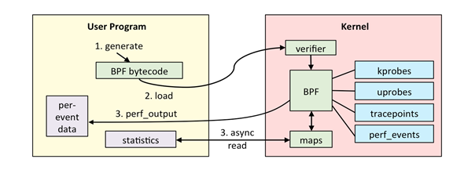

<div align='center'>图3.1  eBPF工作流程</div>

可以看出，收集到的数据是存储在 OS 内部的，而我们则希望将收集到的信息通过GDB，Debug Adapter，最后传送到 VSCode 的调试界面里。如何将存储在OS中的调试信息传送出来？如果和其他内核模块、用户程序的输出一样，直接在终端打印出来，那么这个输出的过程可能会干扰到OS的正常运行，特别是，如果用户想跟踪的代码就是输出函数本身，那么 eBPF 模块在输出了调试信息之后，由于输出过程中调用了输出函数，又会再次激活 eBPF 的代码跟踪，信息收集流程，陷入死循环。这类情况是我们不希望出现的。

我们的解决方案是，将调试信息、调试命令的传输和一般的输出语句分离，通过一个专有的串口进行调试信息，调试命令的传输。这样，eBPF 调试功能就不会影响 OS 的运行状态。

#### 3.3.2 在 qemu-system-riscv64 虚拟机上支持多串口

尽管 Qemu 的官方文档中写到只需要在 Qemu 启动参数中添加 `-serial pty`即可为 Qemu 分配多个串口，但是经过实际测试后发现这个参数在 `qemu-system-riscv64` 虚拟机上并不起作用，查看源代码后发现`qemu-system-riscv64`根本没有支持多串口收发。因此，为了提供基于串口的调试信息、调试命令专有传输渠道，我们修改了 Qemu 虚拟机和 RustSBI 的源代码，提供了多串口特性。

首先，我们为新串口分配了 MMIO 地址和 IRQ（中断号）：

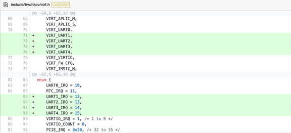

<div align='center'>图3.2  修改头文件，添加新串口的枚举名和中断号</div>

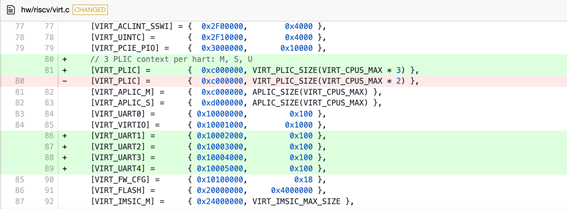

<div align='center'>图3.3  为新串口分配 MMIO 地址</div>

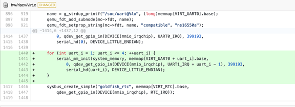

<div align='center'>图3.4  新串口初始化</div>

还修改了设备树初始化函数：

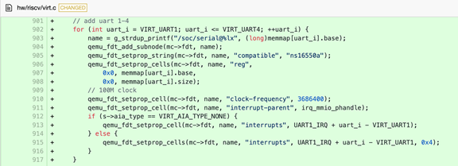

<div align='center'>图3.5  设备树初始化函数</div>

我们发现运行在修改后的 Qemu 中的 rCore-Tutorial-v3 操作系统可以给第二个串口发送消息，但不能接收基于中断机制的消息。这是因为在 RISC-V 中，存在用于保护物理地址的寄存器 pmpcfg 和 pmpaddr [6]。而 rCore-Tutorial-v3 的 SBI（rustsbi-qemu）通过设置这两个寄存器的值，使得只有 SBI 部分和 OS 所在的地址空间可以使用，而PLIC、串口等设备所在的物理地址不可以使用。为了调试方便，我们修改了SBI对 pmpcfg 和 pmpaddr 的设置，使得所有物理地址都可以被使用：

```rust
/// 设置 PMP。
fn set_pmp(_board_info: &BoardInfo) {
    use riscv::register::{
        pmpcfg0, pmpaddr0
    };
    pmpcfg0::write(0x1f);
    pmpaddr0::write(usize::MAX);
    // use riscv::register::{
    //     pmpaddr0, pmpaddr1, pmpaddr2, pmpaddr3, pmpaddr4, pmpcfg0, Permission, Range,
    // };
    // let mem = &board_info.mem;
    // unsafe {
    //     pmpcfg0::set_pmp(0, Range::OFF, Permission::NONE, false);
    //     pmpaddr0::write(0);
    //     // 外设
    //     pmpcfg0::set_pmp(1, Range::TOR, Permission::RW, false);
    //     pmpaddr1::write(mem.start >> 2);
    //     // SBI
    //     pmpcfg0::set_pmp(2, Range::TOR, Permission::NONE, false);
    //     pmpaddr2::write(SUPERVISOR_ENTRY >> 2);
    //     // 主存
    //     pmpcfg0::set_pmp(3, Range::TOR, Permission::RWX, false);
    //     pmpaddr3::write(mem.end >> 2);
    //     // 其他
    //     pmpcfg0::set_pmp(4, Range::TOR, Permission::RW, false);
    //     pmpaddr4::write(1 << (usize::BITS - 1));
    // }
}
```

同时，为了支持第二个串口的通信，我们参考原有的串口相关的代码，对 rCore-Tutorial-v3 做了尽可能少的修改，修改内容包括：

1. 添加第二个串口的初始化例程
2. 修改中断处理例程
3. 添加用于在第二个串口收发单字节的系统调用和 eBPF 帮助函数（helper functions）。

至此，我们实现了基于中断的多串口数据收发，使得 GDB 与 eBPF Daemon 可以通过串口通信。需要注意的是，eBPF 依赖的内核模块是不能通过 eBPF 本身来调试的。比如，eBPF Daemon 依赖内核的串口，如果我们试图让 eBPF Daemon 跟踪这个串口的行为，那么 eBPF Daemon 收集的数据也会通过这个串口来发送，这又会触发 eBPF Daemon 的跟踪，进而陷入死循环。

#### 3.3.3 eBPF Daemon 和 RSP 协议的实现

有了专属的调试信息传输串口后，我们可以通过GDB向这个串口传入调试命令，获取调试信息。但是，这里出现了一个新的问题：OS里由谁来接收从串口传来的调试命令，并根据调试命令进行kprobe, uprobe注册等eBPF相关操作？我们的解决方案是由一个用户态进程进行这些操作，我们把这个用户态进程叫做eBPF Daemon.

我们希望达到的效果是，GDB 在通过 Qemu 提供的 gdbstub 跟踪OS的同时，也通过eBPF Daemon 进行跟踪调试。从GDB的视角来看，相当于一个GDB同时连接了两个GDBServer，且这两个 GDBServer 跟踪的是同一个目标（target）。

这种方案的好处是，用户的使用体验非常统一，不需要在两种调试工具之间切换，只需要在GDB一处操作就可以使用所有调试功能；但是这种方案带来的问题也很明显：如果两个 GDBServer 同时对OS施加控制，势必产生冲突。

在经过一段时间的研究、讨论后，我们发现这种担忧是多余的，因为eBPF 程序具有隔离性，不能不干扰操作系统的运行状态。因此，用eBPF程序编写的 eBPF Server 只有强的动态跟踪能力而没有控制被调试的操作系统的能力。控制功能只能通过 Qemu 虚拟机提供的 gdbserver 来实施。于是，只要所有会改变操作系统状态的控制功能（比如，让操作系统暂停运行）都由Qemu的gdbserver负责，而eBPF Daemon的gdbserver单纯负责信息收集，就不会有任何控制上的冲突问题了。

我们把会改变操作系统状态的那个跟踪技术（Qemu 的 gdbserver 或 OpenOCD ）称为 main-stub，eBPF 的 gdbserver 称为 side-stub。Main-stub 具有可以改变操作系统运行状态的控制能力，而 side-stub 只负责收集信息，不影响内核的状态。下表详细展示了 main-stub 和 side-stub 功能与局限，可以看出，二者形成了很好的互补：

<div align='center'>表3.1  eBPF Server 和 gdbserver 对比</div>

|                          | eBPF Daemon 的 gdbserver                                     | Qemu 的 gdbserver                                            |
| :----------------------- | :----------------------------------------------------------- | :----------------------------------------------------------- |
| 读内存，读寄存器         | 可以                                                         | 可以                                                         |
| 写内存，写寄存器         | 不可以                                                       | 可以                                                         |
| 获取进程控制块等内核信息 | 方便                                                         | 繁琐                                                         |
| 停下（halt）             | 不可以                                                       | 可以                                                         |
| 单步                     | 不可以（原因是不能停下）                                     | 可以                                                         |
| watchpoint               | 不可以（原因是不能停下）                                     | 可以                                                         |
| 跟踪函数调用关系         | 优点：查看函数调用的参数                                     | 优点：查看函数调用栈                                         |
| 断点                     | 类似tracepoint，触发后被调试的操作系统不能停下，主要起辅助作用 | 断点触发后被调试的操作系统会停下，这对于第二章所述的一些静态分析功能来说是必不可少的 |
| 跟踪异步函数             | 由于可以编写帮助函数，因此较方便                             | 较繁琐                                                       |

在用户的使用流程上，两个gdbserver也有差别：eBPF Daemon 要提前指定好检查点（tracepoint）触发后应执行的行为，而Qemu 的 gdbserver 则可以待断点触发，OS暂停后再指定应执行的调试行为。具体如下：

gdbserver 的使用流程：

1. 用户在在线 IDE 中设置断点。
2. 断点触发，操作系统暂停运行。
3. GDB 等待 Debug Adapter 传来的用户的指令，并据此执行信息收集，控制操作系统等行为。

eBPF Server 的使用流程：

1. 用户在在线 IDE 中设置断点并提前指定断点触发后的操作。
2. 操作系统中的 eBPF 模块注册相关的 eBPF 程序。
3. 断点触发，eBPF 程序执行这些操作，返回信息，操作系统继续运行。操作系统的状态和 eBPF 程序触发之前保持一致。

回到 GDB 如何同时连接两个 GDBServer 的问题。利用 GDB 自带的远程调试功能和 Qemu 自带的 gdbstub 功能，我们很容易就能建立 main-stub 和 GDB 的连接。接下来要解决的问题就是如何让 GDB 在连接到 main-stub 的同时也连接到 side-stub，即我们编写的 eBPF Daemon。

GDB 和 main-stub 用 TCP 协议通信，但是由于主线版本的 rCore-Tutorial-v3 暂未提供稳定的网络协议栈和网卡驱动支持（不论是真实网卡还是 Qemu 虚拟机的 virtio 虚拟设备）且 eBPF Daemon 是运行在操作系统里的，因此若要让 eBPF Daemon 用TCP协议连接到 GDB ，实现难度比较大。我们在调研了各种调试器与调试器服务器通信的方案后，选择用串口进行二者的通信。

在有了上一章的实现后，通过串口收发字符串实际上很容易：向特定内存地址读、写字节即可。但是，在串口或网络之上，GDB 和 两个 GDBServer 应该要有一个统一的高层协议，这就是 RSP 协议。

RSP协议规定的基本消息单位是由ASCII字符组成的数据包（Packet），数据包的格式如下图所示：


<div align='center'>图3.6  RSP协议的数据包格式</div>

其中，“$”用于标识数据包的开头，packet-data是传送的实际数据，checksum（即校验值）是“$”和“#”之间所有字符的模 256 和，它是八位无符号整数，编码成ASCII字符后一定占用两个字符，所以“checksum”这三个字符标示了一个数据包的结束。通信的双方在接收到数据包后，可以发送单个“+”字符表示数据包接收成功，或发送"-"表示数据包接收失败，要求重发。

除此之外，还有一种通知数据包（Notification Packet）。它和普通的数据包的区别有两个：1）普通数据包的交流机制是同步的，而通知数据包是异步的，常用于通知 GDB 某个事件的发生，2）收到通知数据包后无需像普通数据包一样发送“+”或“-”。通知数据包的格式如下图所示，可以看到，通知数据包以字符“%”标识开头，而其余的格式和普通的数据包是一致的：


<div align='center'>图3.7  RSP协议的通知数据包格式</div>

这套协议比较简明，且能满足我们的需求，因此，我们在GDB中增加一个子模块，让这个子模块使用 RSP 协议和 side-stub 进行通信。考虑到这个子模块将会有一个持续从串口接收字节流的线程，且有很多字符串处理流程，我们选择用 python 语言来编写这个模块，因为用 python 语言创建和管理线程比较简单，且已经有功能强大的 pyserial 库能够便捷地处理串口消息的收发。

虽然 main-stub 和 side-stub 都使用 RSP 协议，但是在实际的通信上，main-stub 主要以同步的方式收发消息，这是因为Qemu 的 gdbserver 的调试机制是同步的：Qemu 的 gdbserver 一般是在断点被触发，被调试的操作系统停下之后，才开始收集信息的。相比之下，side-stub 的跟踪调试功能主要依赖内核插桩机制，在插桩触发之后 eBPF 程序收集数据，收集完毕后eBPF程序立即退出，操作系统继续运行。side-stub 不会，也不能为了和 GDB 通信而让操作系统停下（而且，操作系统的 eBPF 模块有 verifier 子模块专门用于确保这一点）。因此大部分的信息都会以异步的方式传送给GDB。这种异步的消息处理方式提供了更高的并发性和响应性。然而，异步的消息可能会与同步的消息重合，这就要求和 side-stub 通信的 GDB 子模块具有较好的鲁棒性，能恰当地处理同步信息的字节流被异步信息的字节流打断的情况。

如前文所述，RSP 协议规定，同步的消息以字符“#”开头，而异步的消息以字符“%”开头。利用这个特点，我们设计了一个消息处理流程，可以确保消息的有序处理（图3.8）：GDB中负责和 side-stub 通信的子模块逐字节接收来自 side-stub 的消息，默认情况下按同步信息处理，如果发现接收到了字符“%”，则接下来接收到的字节都放入异步消息处理例程，直到接收到“#”符号和后续的两个校验值后，再返回原来的同步消息处理流程继续从串口接收同步信息。这样，就算同步消息被异步消息打断，同步消息和异步消息都能被完整地接收。

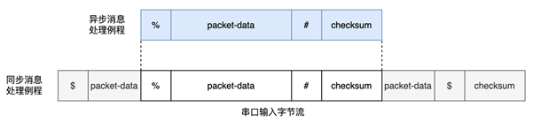

<div align='center'>图3.8  传输同步数据包的消息流被异步的通知数据包打断</div>

由于多个 eBPF 程序不会并发运行，因此异步消息流之间是按顺序发送的，不会互相重叠；运行 eBPF 程序时，操作系统其他部分是不运行的，操作系统中负责收发同步消息的用户态进程也不运行，直到 eBPF 程序发送完了异步消息后，这个用户态进程才会继续运行，继续同步消息的发送，这种机制可以确保异步消息不会被同步消息打断。

上述异步消息处理例程的代码如下：

```python
def read_async_msg(self,starts_with):
    msg=''
    end_count = msg_max_len
    # print("gonna loop")
    while end_count > 0:
        c = self.ser.read(1)
        if c == b'\x00':
            continue
        c = str(c,'ascii')
        # gdb.execute("echo "+c)
        msg+=c
        if c == '#':
            end_count = 3
        end_count -= 1
    gdb.execute('echo '+starts_with+msg+"\n")
```

同步消息处理例程的代码如下：

```python
def msg_reader(self):
    while True:
        input_stream = "" # a packet
        end_count = msg_max_len
        while (end_count > 0):
            c = str(self.ser.read(1),encoding='ascii')
            if c == '+':
                pass
            elif c == '%':
                # print('Percentage Symbol')
                self.read_async_msg(c)
                continue
            elif c == '#':
                end_count = 3
                input_stream+=c
            else:
                input_stream+=c
            end_count-=1
        self.ser.write('+'.encode('ascii'))
```

GDB 允许在不修改源代码的情况下支持 python 语言编写的扩展脚本，然而这个特性在我们使用的 Ubuntu20.04 的包管理器自带的GDB，和RISC-V工具链提供的 GDB 可执行文件中都是关闭的，因此我们需要自行编译一份支持 python 扩展的GDB。

在 GDB 中运行的 python 脚本可以使用 GDB 库，通过继承这个库中的 MICommand 类，我们将这个和side-stub通信的子模块封装成一个 GDB/MI 命令供 Debug Adapter 调用，这种封装也使得在在线 IDE 中适配 side-stub 变得容易（工作量相当于在已有代码的基础上支持一个新的 GDB 命令）。

#### 3.3.3 在 Debug Adapter 中适配 eBPF Server

至此，GDB可以同时连接到 gdbserver 和 eBPF Server. 通过上一章提到的 Python 脚本，GDB 和 eBPF Server 的所有交互都通过统一的 side-stub 命令进行。这个命令的规范如下：

```python
// 连接到eBPF server的串口.
-side-stub target remote <serial>
// 在某内核地址设置跟踪点，然后收集寄存器、CPU、运行时间等信息
-side-stub tracepoint_then_get_registers <address> 
// 在某进程的地址设置跟踪点，然后收集寄存器、CPU、运行时间等信息
-side-stub tracepoint_then_get_registers <program_name> <address> 
```

接下来要在 Debug Adapter 中适配 eBPF Server。从 Debug Adapter 的角度来说，适配的工作主要分两部分，第一个部分是修改用于判断 GDB/MI 消息类别的正则表达式，使得 GDB 传来的 GDB/MI 消息能被正确地处理；第二个部分是，如果在线 IDE 请求执行一些和 eBPF Server 有关的行为，需要将这些行为翻译成对应的 GDB/MI 消息并发送给 GDB。目前，我们已经完成了这些适配。

#### 3.3.4 在在线 IDE 中适配 eBPF Server

与 Debug Adapter 类似，在线 IDE 对 eBPF Server 的适配工作也分两部分：第一个部分是添加和 eBPF Server 有关的用户界面（包含 融合于VSCode界面的 Debug UI 和 一个提供自动化功能，免除输入命令麻烦的 WebView）并将用户界面的相关事件绑定到 Debug Adapter Request 的发送函数上；第二个部分是将 Debug Adapter 传来的 Events 和 Responses 信息进行解析并将这些信息更新到对应的用户界面元素上。

## 4 远程开发环境下的用户界面（集成开发环境）支持与qemu，实际硬件（部分完成）的支持

### 4.1 概述

在各种 OS 开发者、学习者社区中，我们注意到，尝试用 GDB 进行 OS 调试的往往是初学者。因为他们尚处于入门阶段，对于操作系统的各种抽象概念和复杂的代码执行流不熟悉，因此需要通过 GDB 进行操作系统的单步调试，信息收集，来熟悉这些内容。对于初学者来说，学习 OS 的各种机制、策略，读懂错综复杂的 OS 代码，理解OS的编译流程、掌握OS和硬件的交互机制带来的负担已经很大，不应该再在调试器的配置，使用上增加门槛。因此，OS调试工具很有必要提供一个无需命令行操作的，融入现有集成开发环境的友好用户界面。

我们通过插件的形式，为目前最流行的用于编写操作系统（特别是 Rust 操作系统）的开源IDE VSCode 增加了用于 OS 调试的控制菜单、信息栏、通知窗口、按钮，而且这些用户界面的样式、交互模式，信息展示的方式都很贴近原生VSCode，从而降低了工具的学习成本，大大提升了调试体验。

同时，由于OpenVSCode Server，Github Codespace 等基于 VSCode 的远程开发环境的出现，我们的操作系统调试插件可以直接在这些远程开发环境内运行，使用体验和本地的调试环境几乎没有区别。这样，用户只需要有一个浏览器，就可以编写、编译、调试操作系统。

接下来，我们完整地介绍这套基于远程开发环境的操作系统调试器。

### 4.2 整体架构设计

我们设计的在线调试系统通过调试者和被调试内核分离的设计来实现 Qemu 虚拟机或真实系统上的操作系统远程调试。内核在服务器上运行，用户在浏览器里发送调试相关的请求，如下图所示。

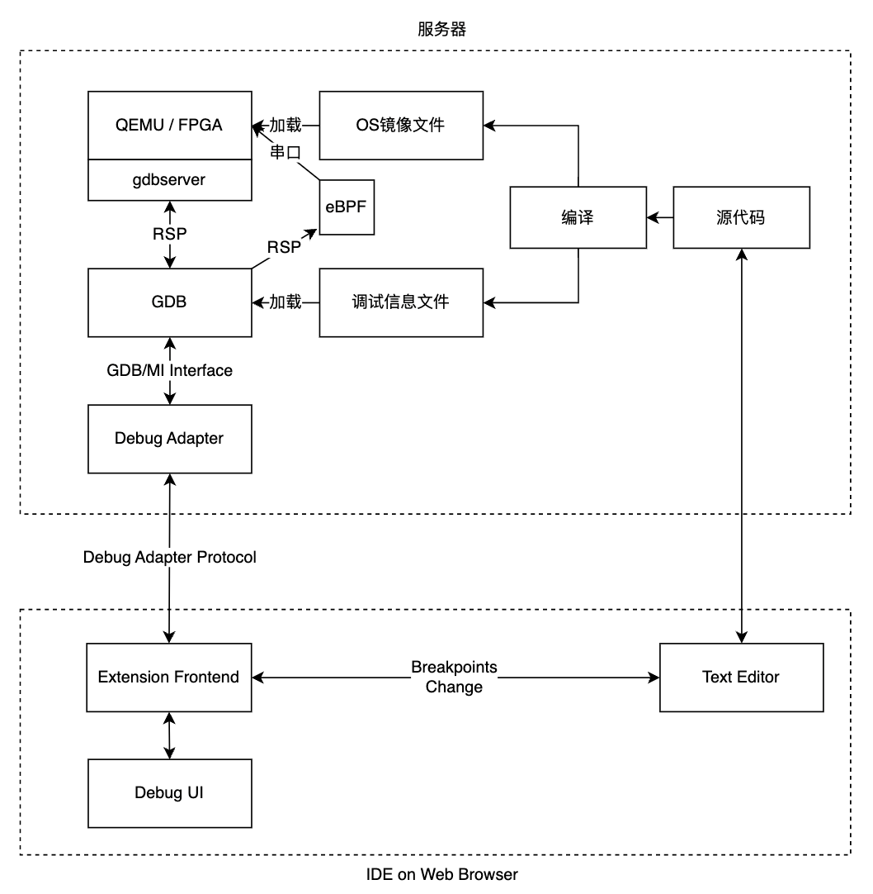

<div align='center'>图4.1  调试工具的整体架构设计</div>

在图4.1中，源代码指待编译的操作系统的源代码，当用户发出编译请求时，服务器中的 rust 工具链会通过特定的编译参数编译操作系统源代码，产生满足操作系统调试要求的操作系统镜像和调试信息文件。如果用户接下来发出调试请求，服务器中的 Qemu 或服务器连接的 FPGA 硬件就会加载操作系统镜像（本项目以 Qemu 为例），服务器中的 GDB 会加载调试信息文件并连接至 Qemu 的 gdbserver。

图中 Extension Frontend 是运行在用户浏览器中负责操作系统调试相关功能的模块。Debug Adapter 是运行在服务器中的独立进程，负责处理 Extension Frontend 发送来的请求。当 GDB 成功加载调试信息文件并连接至 Qemu的 gdbserver 后，Debug Adapter 进程启动并开始接收 Extension Frontend 发送来的请求。Debug Adapter 会将请求转换为 GDB 指令发送给 GDB。GDB 在执行完 GDB 指令后将 GDB/MI 格式的信息返回给 Debug Adapter。Debug Adapter 解析后将结果返回给 Extension Frontend。

如果用户开启了 eBPF 跟踪功能，相关的eBPF模块（被调试OS里的eBPF Daemon、GDB中的通信模块、在线IDE的用户界面等）会随着GDB的启动而激活，提供更加强大和灵活的动态跟踪调试功能。

Extension Frontend 收到 Debug Adapter 发送来的消息后，会将这些消息转换为界面更新消息，发送给在线IDE上的调试界面（图中 Debug UI）和文本编辑器模块（图中 Text Editor）。同样，Debug UI 和Text Editor 也可以向 Extension Frontend 发送消息，比如断点更新消息。

要完成以上的流程，服务器中需安装 openvscode-server、操作系统调试模块（以VSCode插件的形式提供）、Qemu，包含GDB-python的risc-v工具链、rust 工具链。用户可以手动配置服务器中的安装这些软件，也可以使用我们配置好的包含以上工具的 docker 容器，免去了配置的麻烦。

接下来我们分服务器和网页端两个部分介绍这套远程调试工具。

### 4.3 服务器部分

#### 4.3.1 在线 VSCode 调试环境

OpenVSCode Server 是 VS Code 的一个分支，它在 VSCode 原有的五层架构的基础上增加了服务器层，使其可以提供一个和 VSCode 功能相近的，通过浏览器即可访问的在线IDE。这个在线IDE可以和服务器上的开发环境、调试环境通信。

用户可以在在线 IDE 上编辑项目源代码，同时可以远程连接到服务器上的终端。我们在服务器里配置好了 Qemu 虚拟机和 GDB、Rust 工具链。用户可以自行通过终端命令使用 Qemu、GDB 等工具手动调试自己编写的操作系统，也可以通过在线 IDE 中的操作系统调试模块进行更便利的调试。

如果用户选择用操作系统调试模块进行调试，操作系统调试模块做的第一步是编译内核并获取操作系统镜像文件和调试信息文件。接下来我们以 rCore-Tutorial-v3 [3]操作系统为例，阐述如何获取这两类文件。

#### 4.3.2 Qemu 和 GDB 的启动流程

在编译完成后，服务器上的 Qemu 会加载操作系统镜像，并开启一个 gdbserver。接着，GDB 加载编译时生成的符号信息文件并连接到 Qemu 提供的 gdbserver。如果用户开启了 eBPF 跟踪功能，Qemu中运行的操作系统会启动基于 eBPF 的调试服务器（即 eBPF server）。这个基于 eBPF 的调试服务器会通过其专属的调试用串口连接到GDB上的 eBPF 调试处理模块。

GDB 与 gdbserver、eBPF server 通过 GDB 远程串行协议 (RSP) [5]进行通信。RSP 是一个通用的、高层级的协议，用于将 GDB 连接到任何远程目标。 只要远程目标的体系结构（例如在本项目中是RISC-V）已经被 GDB 支持，并且远程目标实现了支持 RSP 协议的服务器端，那么 GDB 就能够远程连接到该目标。

#### 4.3.3 调试适配器和VSCode、GDB的交互

调试适配器（Debug Adapter）是一个独立的进程，它负责协调在线 IDE 和 GDB。在 GDB 准备就绪后，Debug Adapter 进程会启动，并开始监听在线 IDE 中 Extension Frontend 模块发送来的各种调试请求。

如下图所示，一旦 Debug Adapter 接收到一个请求，它就会将请求（Debug Adapter Requests）转换为符合 GDB/MI 接口规范（GDB/MI 是一个基于行的面向机器的 GDB 文本接口，它专门用于支持将调试器用作大型系统的一个小组件的系统的开发。）的文本并发送给 GDB。GDB 在解析、执行完 Debug Adapter 发来的命令后，返回符合 GDB/MI 规范的文本信息。Debug Adapter 将 GDB 返回的信息解析后，向 Extension Frontend 返回 Debug Adapter Protocol 协议的 Respond 消息。此外，调试过程中发生的特权级切换、断点触发等事件会通过 Debug Adapter Protocol 协议的 Event 消息发送给 Extension Frontend。

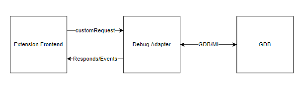

<div align='center'>图4.2 Debug Adapter 和GDB、Extension Frontend的通信机制</div>

#### 4.3.4 实际硬件的支持（部分完成）

我们已经完成了调试运行在qemu上的操作系统的工作。为了进一步测试调试器的功能，我们尝试将操作系统镜像烧录进真实硬件中，并实现调试功能。硬件方面我们使用的是昉星光2开发板，操作系统选用的是基于rust的操作系统Alien(作者：陈林峰)。

实现思路如下：首先通过cortex-debug或者命令行调试，实现对openocd的调试，然后再通过修改参数将openocd接入陈林峰的alien os的openocd接口 ，最后，将我们的code-debug替换第一步的调试手段。但是由于openocd不直接支持昉星光2这块板子，所以我们需要使用jtag来辅助openocd接入开发板并实现openocd对操作系统的调试功能。

目前已经实现了将Alien烧录进开发板并运行，但是由于时间等原因，暂未实现调试器的适配，这个是我们未来的工作之一。

### 4.4 网页端部分

在用户浏览器上运行的在线 IDE 中，一个被称作 Extension Frontend 的模块负责和和服务器上的 Debug Adapter 通信。它监听Debug Adapter接收和发出的消息并做出反馈，如更新用户界面、根据用户请求发送 Requests、响应 Responses 和 Events等。Extension Frontend会解析接收到的Responds和Events并将需要的信息转发至WebView。如果WebView向Extension Frontend传递了某个消息，Extension Frontend也会将这个消息转换为Requests发送给Debug Adapter（图2.3）。这种传递信息的方式有比较高的自由度。

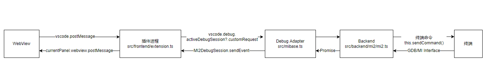

<div align='center'>图4.3 Extension Frontend和其他模块的信息传递链路</div>

不同类型的数据的更新策略是不一样的，具体见下表：

<div align='center'>表4.1  不同类型数据的更新策略</div>

|名称|功能|更新策略|
|:----|:----|:----|
|寄存器信息|显示寄存器名及寄存器值|触发断点或暂停时更新|
|内存信息|显示指定位置和长度的内存信息，可增删|触发断点、暂停、用户修改请求的内存信息时更新|
|断点信息|显示当前设置的断点以及暂未设置的，缓存的其他内存空间下的断点（比如在内核态时某用户程序的断点）|触发断点或暂停时更新|

VSCode在近期的更新中，添加了一些新的API，提供了原生debugger 界面的支持，因此最外层 WebView 与 VSCode 的交互会显得比较冗余。一个更好的方案是使用VSCode的 TreeView 来取代 WebView 的一部分功能，使调试器界面和VSCode原生界面更好地融合，提高用户体验。（图3.4）

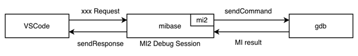

<div align='center'>图4.4  基于新API的架构</div>

在这个新的架构中，我们通过VSCode 提供的几个重要的原生 request 接口来展示数据。比如 variablesRequest，其功能是在在线IDE窗口左侧的 debugger 标签页中，顶部VARIABLES 标签栏里展示变量的名字与值。每当代码调试因触发断点等原因发生了暂停，在线 IDE 都会自动发送一个 variablesRequest 向 Debug Adapter 请求变量数据。我们添加了一个自定义的 variablesRequest获取到寄存器数据，从而在更贴近原生界面的 TreeView 里展示寄存器数据。（图4.5）

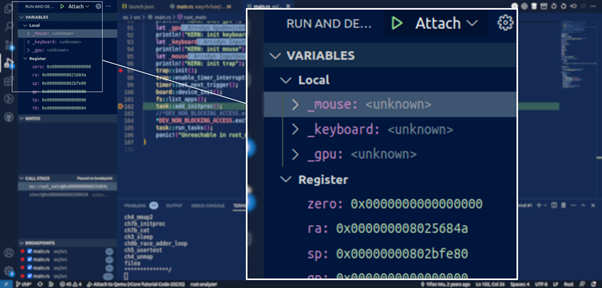

<div align='center'>图4.5  通过TreeView展示数据</div>

WebView除了展示数据外，还提供了一些命令按钮。我们利用新API将这些WebView中的命令按钮改为原生按钮，放置到编辑器的上方，和原生界面融为一体，如下图所示：

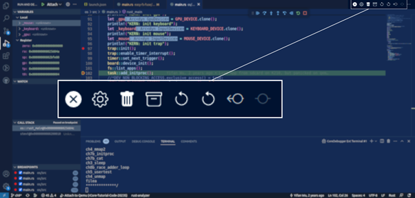

<div align='center'>图4.6  原生样式的命令按钮</div>

其中按钮的功能如下表所示：

<div align='center'>表4.2  调试界面按钮的名称及功能</div>

|名称|功能|
|:----|:----|
|gotokernel|在用户态设置内核态出入口断点，从用户态重新进入内核态|
|setKernelInBreakpoints|设置用户态到内核态的边界处的断点|
|setKernelOutBreakpoints|设置内核态到用户态的边界处断点|
|removeAllCliBreakpoints|重置按钮。清空编辑器，Debug   Adapter, GDB中所有断点信息|
|disableCurrentSpaceBreakpoints|令GDB清除当前设置的断点且不更改Debug Adapter中的断点信息|
|updateAllSpacesBreakpointsInfo|手动更新断点信息表格|

此外我们还支持了VSCode自带的继续、单步等常见的调试功能按钮，如下图所示：

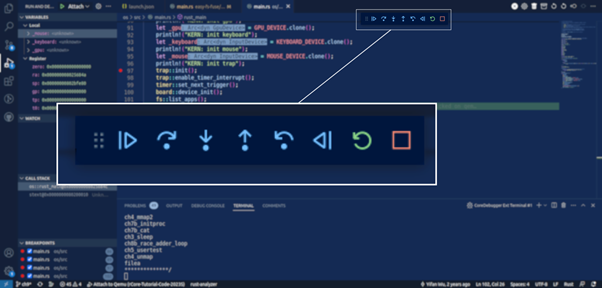

<div align='center'>图4.7  调试功能按钮</div>

此外，我们也为 eBPF 调试功能量身打造了一个用户界面，用户只需要用鼠标点击，即可进行串口连接，符号转地址，注册kprobe/uprobe等调试操作：

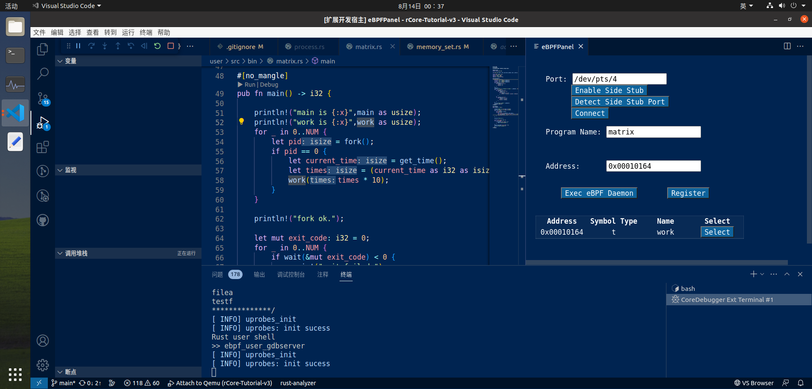

<div align='center'>图4.8 eBPF调试界面</div>

## 5 应用实例

为了更好地演示调试器的功能和使用流程，接下来我们展示五个实际应用该调试工具的例子。前三个例子（当前特权级检测、内核态与用户态间方便的切换跟踪、系统调用跟踪及系统调用参数的获取）是比较基础的。即使整个调试流程不需要输入任何终端命令，为了展示一些被图形界面掩盖的技术细节，我们在这三个例子的演示流程中还是使用了终端界面；最后一个例子（漏洞修复）来源于实际编程中遇到的问题，相比前几个例子来说有一定复杂度，是我们认为用户在 OS 开发过程中会真正遇到的问题，因此，在后两个例子中，我们完整地模仿我们预想中的用户使用流程，完全采用我们编写的图形界面来演示。

### 5.1 当前特权级检测

调试操作系统与调试一般应用程序的一大区别是，调试操作系统时用户经常需要关注当前运行在什么特权级上。因此，操作系统调试工具需要有检测当前特权级的功能。我们以特权级检测为例，展示这个操作系统调试工具的典型处理流程。

当 Extension Frontend 监听到 GDB 触发断点、用户手动暂停、或 Debug Adapter 发送了 stopped Event 时，Extension Frontend 发送一个 customRequest 请求 Debug Adapter 返回当前特权级、寄存器数据、内存数据、断点列表等信息。

接着 Debug Adapter 响应这些请求，向 GDB 发送命令。RISC-V 处理器没有寄存器可以透露当前的特权级，因此不能直接通过 info registers 这个 GDB 命令获得当前特权级。Debug Adapter 会尝试获取当前执行的代码的内存地址和文件名，进而判断当前的特权级。

在得到当前所在的特权级后，Debug Adapter 向 Extension Frontend 返回 Responses。Extension Frontend 接收并解析 Responses 和 Events，将信息传递到 Debug UI。Debug UI 收到信息后更新界面。（图5.1）

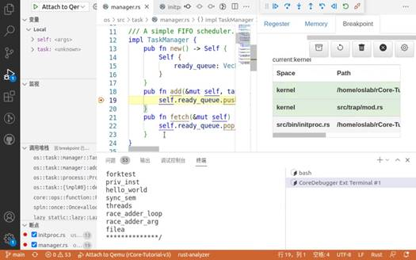

<div align='center'>图5.1  更新特权级后的调试器界面。在右侧窗口的上方，可以发现此时操作系统处于内核态</div>

### 5.2 内核态与用户态间方便的切换跟踪

本项目解决的一个调试操作系统时面临的难点是内核态与用户态间的切换跟踪。通过我们编写的调试工具，用户只需要根据自己计算机上的环境调整一个配置文件launch.json（图4.2），用户通过这个配置文件指定需要调试的操作系统的位置以及QEMU虚拟机的启动参数。配置完毕后，用户即可开始进行内核态与用户态间的切换跟踪：

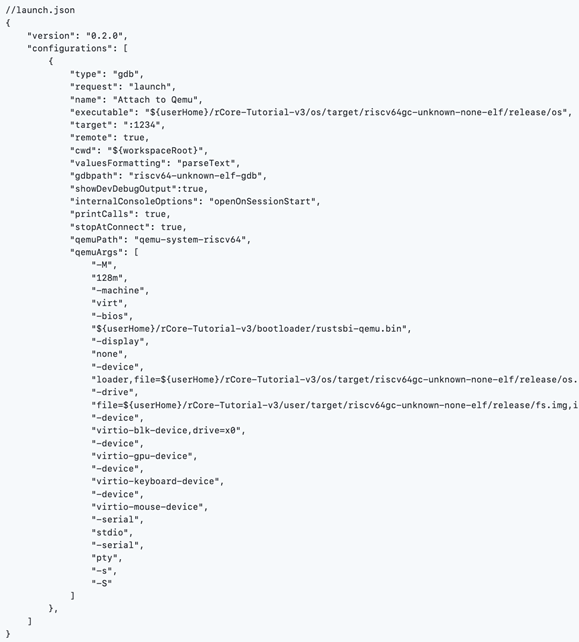

<div align='center'>图5.2 launch.json配置文件</div>

配置launch.json并保存后，按F5键，即可启动调试进程。

首先按下removeAllCliBreakpoints按钮清除所有断点：

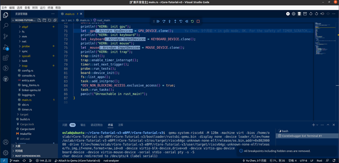

<div align='center'>图5.3  清除所有断点。右下角的通知显示清除成功</div>

其次，设置内核入口（setKernelInBreakpoints按钮）、出口断点（setKernelOutBreakpoints按钮）。

最后，设置内核代码和用户程序代码的断点。这两种断点可以同时设置，调试插件会自动进行断点组的缓存与切换。

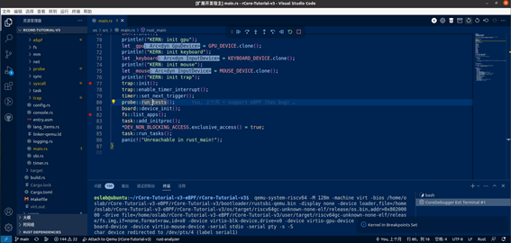

<div align='center'>图5.4  设置内核代码断点</div>

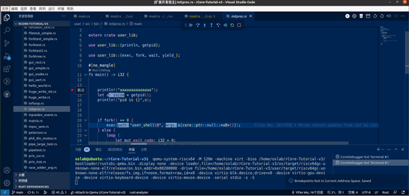

<div align='center'>图5.5  设置用户程序代码的断点。右下角的通知显示，这个断点被缓存到了断点组中</div>

断点设置完毕后，按continue按钮开始运行rCore-Tutorial。当运行到位于内核出口的断点时，插件会自动切换到用户态的断点：

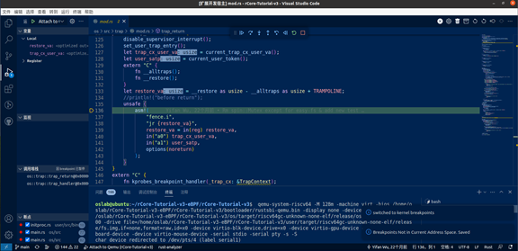

<div align='center'>图5.6  边界断点触发，右下角的通知显示插件自动进行了断点组切换</div>

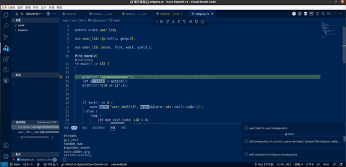

<div align='center'>图5.7  触发用户态程序的断点</div>

在用户态程序中如果想观察内核内的执行流，可以点击gotokernel按钮，然后点击继续按钮，程序会停在内核的入口断点，这时，可以先把内核出口断点设置好（点击setKernelOutBreakpoints按钮），接下来，可以在内核态设置断点，点击继续，即可触发内核断点：

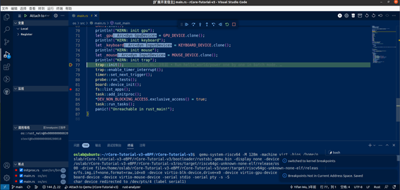

<div align='center'>图5.8  回到内核，再次触发内核断点</div>

如果运行到内核的出口断点，又会回到用户态。

### 5.3 系统调用跟踪及系统调用参数的获取

我们以系统调用跟踪及系统调用参数的获取为例，展示这套调试工具的使用流程。

首先，在 rCore-Tutorial-v3 中，每个系统调用都会被分发到对应的内核函数中进行处理，这些函数最多只有三个参数。根据RISC-V的函数调用规范（calling conventions），它的函数调用过程通常分为以下6个阶段[7]：

1. 将参数存储到函数能够访问到的位置；
2. 跳转到函数开始位置(使用 RV32I 的 jal 指令)；
3. 获取函数需要的局部存储资源，按需保存寄存器；
4. 执行函数中的指令；
5. 将返回值存储到调用者能够访问到的位置，恢复寄存器，释放局部存储资源；
6. 返回调用函数的位置(使用 ret 指令)。 在第三个阶段结束后获取函数的参数是比较容易的。查阅函数调用规范（图5.9）后可知，我们需要的三个函数调用参数会分别被放在a0, a1 和 a2 寄存器上。

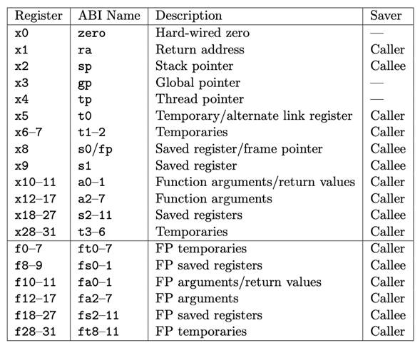

<div align='center'>图5.9  RISC-V函数调用规范</div>

因此，若要获取系统调用的参数，我们只需要编写一个能获取寄存器信息的 eBPF 程序，并在需要跟踪的系统调用对应的内核函数上插桩即可。

eBPF 程序可以用多种语言编写，在这里我们选用 C 语言。eBPF 程序的代码如下：

```c++
#include "bpf.h"
#include "kprobe.h"
// 只收集寄存器信息
int bpf_prog(struct kprobe_bpf_ctx *ctx) {
  bpf_trace_printk("%", 0, 0, 0); //字符串是rust 格式的
  bpf_trace_printk("R", 0, 0, 0); //用于标识消息类别
  for (int i = 0; i < 3; ++i) {
    bpf_trace_printk("{}", ctx->tf.regs[i], 0, 0);//发送寄存器数据
  }
  bpf_trace_printk("#", 0, 0, 0);
  bpf_trace_printk("00", 0, 0, 0);
  return 0;
}
```

```c
#include "bpf.h"
#include "kprobe.h"
// 收集寄存器、运行时间、CPU、地址、PID信息
int bpf_prog(struct kprobe_bpf_ctx *ctx) {
  bpf_trace_printk("%", 0, 0, 0); //Rust Fotmat! 
  bpf_trace_printk("M", 0, 0, 0); //M = messages. R = registers.
  bpf_trace_printk(" Time: {}",bpf_ktime_get_ns(),0,0);
  bpf_trace_printk(" vCPU: {}",bpf_get_smp_processor_id(),0,0);

  // report tracepoint address
  bpf_trace_printk(" Addr = {}", ctx->paddr, 0, 0);

  i64 id = bpf_get_current_pid_tgid();
  int pid = id & 0xffffffff;
  bpf_trace_printk(" PID: {}", pid, 0, 0);

  // report registers
  bpf_trace_printk(" Registers:",0,0,0);
  for (int i = 0; i < 32; ++i) {
    bpf_trace_printk(" x{}:", i,0,0);
    bpf_trace_printk("{},", ctx->tf.regs[i], 0, 0);
  }
  bpf_trace_printk("#", 0, 0, 0);
  bpf_trace_printk("00", 0, 0, 0); //todo: modulo 256 checksum
  return 0;
}
```

需要注意的是，由于 rCore-Tutorial-v3 的eBPF模块的字符串处理例程直接调用了 Rust 语言的字符串处理函数，因此字符串是 Rust 格式的。编写后，用 Clang 编译器编译到 eBPF 目标。

接着，将编译出的目标文件以硬编码的形式存储在eBPF Server中。至此代码的修改完成，我们可以编译、启动整套调试工具。

我们在在线 IDE 中点击“运行 - 调试”，调试工具就会自动连接到虚拟机提供的 gdbserver。然后我们可以设置 main-stub 的断点：

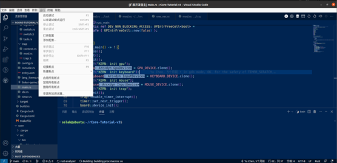

<div align='center'>图5.10  开始调试，启动gdbserver</div>

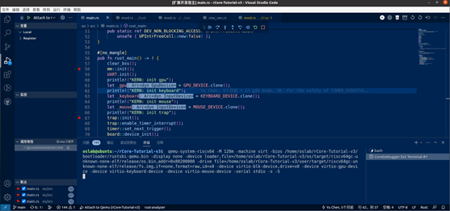

<div align='center'>图5.11  设置断点，从下方终端可以看到Qemu虚拟机已经启动</div>

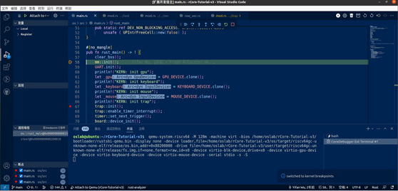

<div align='center'>图5.12  位于第58行的main-stub的断点触发</div>

在设置完main-stub的断点后，我们按“continue”启动虚拟机。启动之后，在终端中打开 eBPF Server，此时 eBPF Server 可以通过串口和 GDB 中对应的子模块通信：

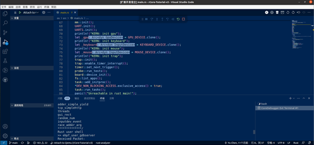

<div align='center'>图5.13  在终端中打开eBPF Server。可以看到eBPF Server正在从串口接收消息</div>

我们让GDB 中对应的子模块连接到 eBPF Server。在调试控制台中输入下列命令启用GDB中的eBPF子模块：

```c++
so ~/rCore-Tutorial-v3-eBPF/rCore-Tutorial-v3/side-stub.py

调试控制台输出以下信息，表示成功启用该模块。
{"token":14,"outOfBandRecord":[],"resultRecords":{"resultClass":"done","results":[]}}

接着令这个模块通过串口连接到eBPF Server：
-side-stub target remote /dev/pts/4

调试控制台输出以下信息，这说明连接成功：
{"token":18,"outOfBandRecord":[],"resultRecords":{"resultClass":"done","results":[]}}

最后输入要跟踪的系统调用。此处我们以 sys_open 为例：
       -side-stub break sys_open then-get register-info

调试控制台再次响应，表示插桩成功：
{"token":19,"outOfBandRecord":[],"resultRecords":{"resultClass":"done","results":[]}}
```

接下来可以看到，当我们跟踪的内核函数被触发时，eBPF程序运行并收集信息，返回了我们需要的三个参数：

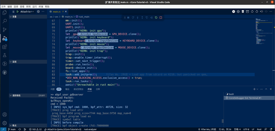

<div align='center'>图5.14  操作系统输出eBPF相关的日志，表示我们跟踪的内核函数被触发</div>

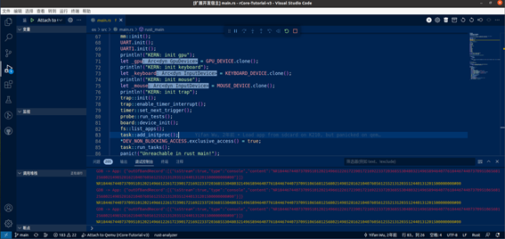

<div align='center'>图5.15  寄存器数据以高亮字体输出</div>

### 5.4 Http服务器漏洞修复

接下来我们同时运用GDB断点和eBPF调试功能，用我们的调试器调试 rCore-Tutorial 自带的 http 服务器，从中可以看出 GDB+eBPF 带来的调试上的方便。

#### 5.4.1 Bug 描述

`tcp-simplehttp` 是 rCore-Tutorial 自带的一个简单的 HTTP 服务器。服务器启动之后，在 Firefox 浏览器访问对应的 URL 即可获得服务器返回的静态页面。但是，如果我们在浏览器里打开多个标签页，每打开一个标签页，就在这个标签页里访问服务器的URL，就会发现一个奇怪的现象：一部分标签页成功显示出了网页，另一部分则一直在加载中，始终无法显示网页。而且，加载成功的标签页和加载失败的标签页是**交替出现**的。

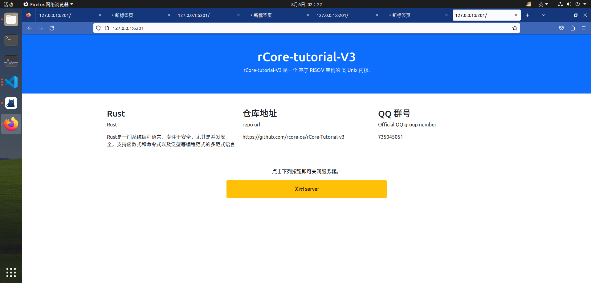

<div align='center'>图5.16 tcp_simplehttp服务器程序未返回所有请求的网页</div>

作为对比，我们用同样的方式重复打开全国大学生计算机系统能力大赛的官网，结果是所有标签页都正常地打开了：


<div align='center'>图5.17 全国大学生计算机系统能力大赛的官网成功返回所有请求的网页

接下来，我们尝试在操作系统调试器的帮助下找到出错的原因并修复这个错误。

#### 5.4.2 代码简述

在开始使用调试器之前，我们阅读了这个服务器的源代码，从而大致了解了它的工作流程：当服务器启动，进入到main函数后，main函数就会调用`listen()`库函数，在80端口开始监听。如果接收到客户端的连接，就调用handle_tcp_client 函数处理来自客户端的请求。handle_tcp_client 函数会先读取请求并检查是否为有效的 HTTP GET 请求，如果是的话，就从请求中提取出 URL ，并返回 URL 对应的 HTML 网页。此外，如果用户访问的是 `/close` 页面，服务器会在返回一个表示服务器关闭的网页后终止连接，并关闭服务器自身。

#### 5.4.3 Debug过程

首先，我怀疑服务器是否接收到了所有的 HTTP 请求。因此我们在服务器的 `accept()` 函数设置一个 eBPF 断点。这个 eBPF 断点会返回当前的所有寄存器值。从而获得`accept`函数的返回值和参数。

设置断点后，我们打开服务器，重复访问同一个网址。发现了两个异常现象：

1. 在浏览器尚未访问网址时，`accept()`函数就被调用了一次。
2. 浏览器打开六个标签页（每一个标签页都向服务器请求同一个网址），只有四个标签页正确显示出了内容。accept()函数在这段时间内只触发了四次断点，正常状况下应该是六个断点才对。

这个初步的尝试显示，问题可能出在内核没有成功接收到所有的 HTTP 请求，或者内核接收到了所有的请求，却没有全部传送给应用程序。

为了确认具体的出错位置，我们从内核网络栈的代码到系统调用,再到用户态程序上设置了多个内核和应用程序的eBPF断点，看看是哪个环节出了问题。

跟踪的内核函数如下：

| 函数名                | 地址             |
| --------------------- | ---------------- |
| receive               | 000000008021c0ca |
| net_interrupt_handler | 0000000080212c24 |
| sys_accept            | 0000000080216e5a |

在`sys_accept()`之上还有`syscall()`函数。但是由于用 eBPF 跟踪`syscall()`函数会造成死循环（原因是 eBPF 系统调用也会调用这个函数）我们用GDB跟踪`syscall()`函数。

跟踪的用户函数如下：

| 函数名 | 地址       |
| ------ | ---------- |
| listen | 0x000109fe |
| accept | 0x00010a1c |

设置完断点后，我们和刚才一样，重复访问网页六次，发现六个网页只正常打开了四个。回到 VSCode 查看调试信息和GDB断点，发现`listen`被调用一次（这是正常的），其他函数都被调用四次，那说明问题并不出在网络协议栈函数的调用流程上。

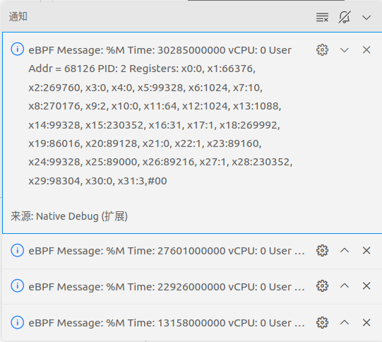

<div align='center'>图5.18 eBPF检查点触发，弹出调试信息</div>

于是，我们又怀疑，原因可能是我们过于频繁地访问网页，而这个服务器程序在处理过于频繁的请求时会出错。为了验证这个猜想，我们在`sys_accept`、`write`函数设置GDB断点，这样每次处理accept时OS都会停下来，减缓了服务器程序的处理速度。然而，同样的异常现象（六个网页只打开四个）还是出现。

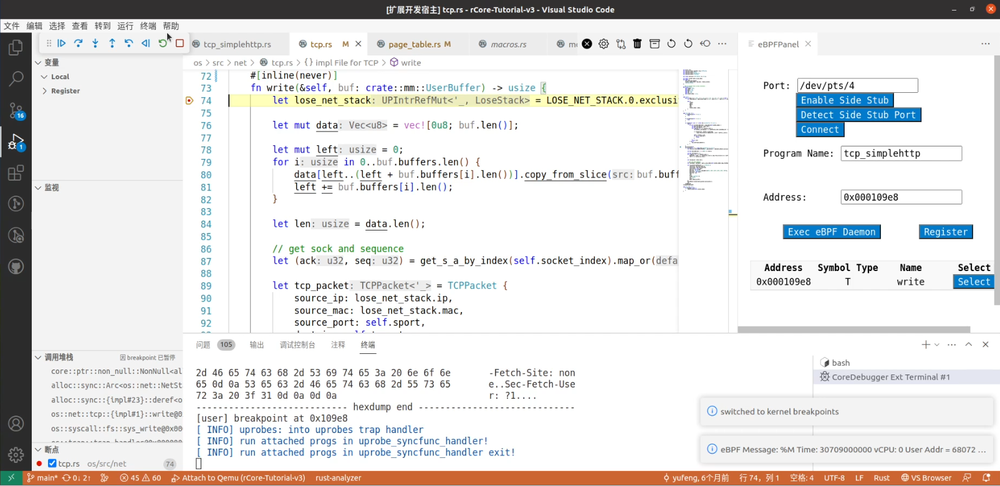

<div align='center'>图5.19 `write`函数的GDB断点触发</div>

我们又想到，如果流程是正确的，就需要考虑发送的内容是否有错误。于是，我们检查了服务器返回信息的函数，终于发现了出错的原因：在服务器发送的http response中，`Connection:Close`中的字母t被遗漏了，变成了`Connecion:Close`，导致前一个连接没有被正确关闭，所以后一个连接无法成功建立。

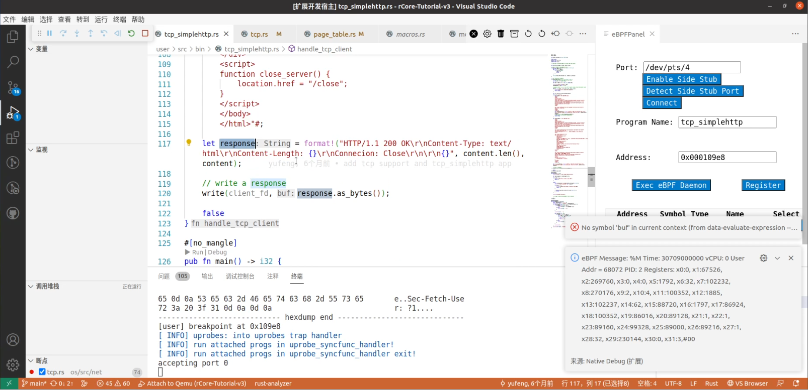

<div align='center'>图5.20 出错的代码</div>

这样，结合 eBPF 和 GDB 两种调试手段，我们根据调试器提供的线索快速定位并修复了这个bug。除了这一处代码，在整个Debug的过程中，我们不需要出于调试目的而改动任何其他的源代码。

## 致谢

感谢团队成员（陈志扬，向驹韬）之间的相互鼓励和支持，感谢指导老师（吴竞邦老师，赵霞老师）不辞劳苦对本项目的引导！

## 参考文献

[1] Hongfei Fan,Kun Li,Xiangzhen Li,Tianyou Song,Wenzhe Zhang,Yang Shi,Bowen Du. CoVSCode: A Novel Real-Time Collaborative Programming Environment for Lightweight IDE[J]. Applied Sciences,2019,9(21).

[2]张磊,麦先根,田丹等. 基于QEMU的仿真软件多核系统级调试的方法[P]. 陕西省：CN115658227A,2023-01-31.

[3]孙卫真,刘雪松,朱威浦等.基于RISC-V的计算机系统综合实验设计[J].计算机工程与设计,2021,42(04):1159-1165.DOI:10.16208/j.issn1000-7024.2021.04.037.

[4]张兴华,蒋应俊.DWARF调试信息解析方法研究[J].电子技术与软件工程,2015,No.55(05):254-255.

[5]于佳佳. 基于QEMU的龙芯3A处理器数字化设计与实现[D].电子科技大学,2018.

[6]焦芃源,李涵,李翔宇等.一款安全RISC-V处理器特权模式和内存保护测试[J].北京信息科技大学学报(自然科学版),2021,36(03):82-87.DOI:10.16508/j.cnki.11-5866/n.2021.03.014.

[7]贾金成,朱家鑫,唐震等.映射字典导向的64位ARM到RISC-V汇编翻译[J/OL].小型微型计算机系统:1-8[2023-05-23].<http://kns.cnki.net/kcms/detail/21.1106.TP.20230518.1124.004.html>.

[8]陈志扬.ruprobes模块[EB/OL].[2023-08-10](2023-08-13). [https://github.com/chenzhiy2001/ruprobes.](https://github.com/chenzhiy2001/ruprobes.)

## 系统调用跟踪

### 利用GDB进行syscall跟踪的传统方法

### 利用VSCode进行自动化的系统调用跟踪

#### VSCode提供的自动化API

#### 特权级切换时自动进行单步

#### 断点组切换

### 展望 - 怎么通过软硬件结合的方法跟踪异常

这个事情是朱毅在泉城的时候跟我说的。他意思是说

## eBPF增强跟踪能力

### 什么是eBPF（eBPF不影响OS的运行状态）用eBPF的好处（更加灵活，缓解编译器调试信息不全带来的种种困扰。GDB就像x光，eBPF就像肠镜）

### 我们用eBPF进行调试的思路（插桩-运行eBPF收集信息-利用串口输出信息）

### 以rCore-Tutorial-v3为例，怎么实现这种跟踪能力

#### 给rCore-Tutorial-v3添加eBPF

##### 模块化了别人的库

##### OS本身的修改

#### 传输调试信息

##### 怎么添加串口输入输出的功能

##### GDB怎么同时把两种调试信息处理清楚

## 一个实际的debug例子，用文本的GDB很难弄清楚，但是用调试器就能快速搞定的

## 致谢

## 引用

[1] 前年发的那篇小论文
[2] ArceOS的链接
