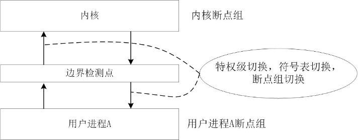
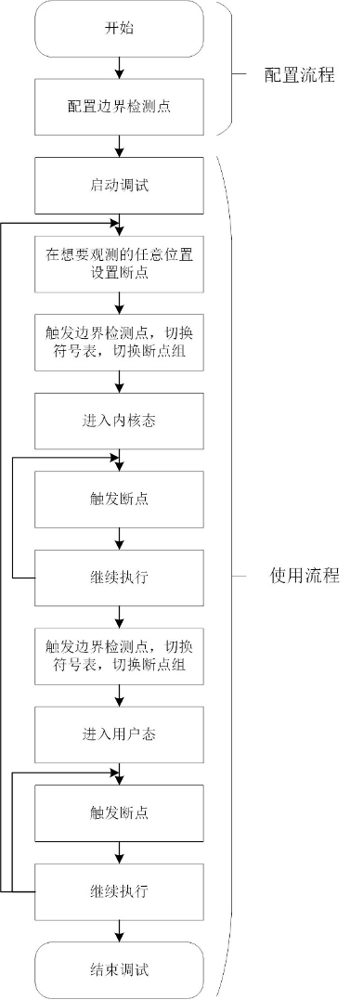
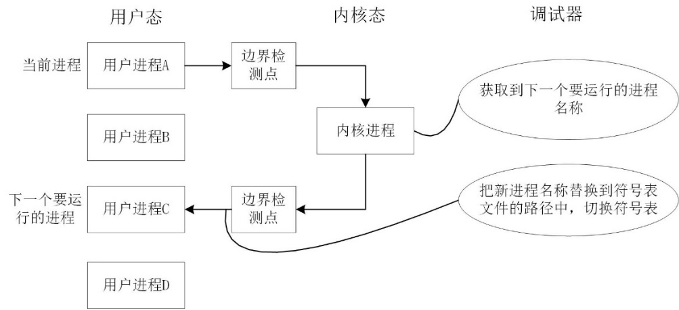

# 支持Rust语言的源代码级操作系统调试工具

## 摘要

近年来，由于RISC-V的开源、简洁，Rust语言可以在不牺牲性能的情况下实现内存安全和对内存的精细化控制，基于RISC-V的Rust操作系统在学术界与产业界有大量的研究与开发工作。然而，研究人员或工程师在开发或调试相关代码时缺少一款适1配的源代码级调试工具，使得开发过程艰难繁琐。传统的调试器，如 GDB 或 LLDB 不能很好地适应 RISC-V 上 Rust 操作系统的开发，因为在操作系统运行的过程中，会频繁地进行特权级的切换，导致调试信息丢失。而且，GDB 或 LLDB 对 Rust 语言的支持还不够完善，导致一些重要的调试信息无法获取到。为了解决这些问题，我们开发了 code-debug ，一个支持Rust语言的源代码级操作系统调试工具。它可以提供基于QEMU和GDB的跨特权级的源代码跟踪调试，支持同时调试内核和多个用户态进程，且支持同时使用GDB断点和 eBPF 来收集调试数据。

关键词：Rust操作系统；操作系统调试器；多进程调试；GDB；eBPF

## 1 Introduction 概述

操作系统（OS）是驱动硬件运行的核心系统，其在硬件和用户之间起到了桥梁的作用。包括基于C语言以及基于RUST语言的操作系统内核代码调试一直是开发人员面临的技术难点。不同于通用应用程序代码调试，操作系统源代码运行状态多、工作逻辑复杂，使得传统的调试方法难以适应其开发调试工作。因此，方便的源代码级调试工具，对监测程序运行状态和理解程序的逻辑十分重要，尤其是相对复杂的内核代码以及用户态、内核态的系统调用交互。

操作系统运行状态一般分为用户态和内核态，属于两个不同的特权级，拥有不同的执行权限。当应用程序需要执行一些特权操作或与操作系统交互时，它需要通过系统调用的方式从用户态切换到内核态。特权级的应用提供了应用程序与核心系统之间的隔离，可以有效防止应用程序对系统造成损害，并优化系统的资源利用。但另一方面，特权级的切换会清除调试状态信息，使得传统程序调试方法失效。除此以外，操作系统需要一个运行在一个指定的硬件环境中，所以调试方式和普通应用程序的调试有所不同。QEMU（Quick Emulator）是一个完全由软件实现的开源虚拟机，它可以提供操作系统运行所需的硬件条件，操作系统运行在QEMU模拟器中，操作系统调试器运行在宿主机中，使用这种方法可以让操作系统的开发与调试变得更加便捷。

调试器的主要功能是能够让使用者控制被调试软件的运行，并提供一系列工具实时查看被调试软件运行过程中的中间状态，为使用者定位程序问题以及修改代码提供帮助，是相关软件开发中不可缺少的一种工具。GNU调试器（GDB）允许程序员查看被调试程序的运行状态、检查变量和内存、设置断点等，因此被广泛地用于调试操作系统[参考文献]。在GDB的基础上，有许多继承调试环境如VSCode、Visual Studio、Eclipse、XCode等，提供应用程序的代码开发和调试功能。

为应对此问题，我们提出了一种名为“断点组切换”的机制。该机制的核心思想是将用户设置的GDB断点根据它们所在的地址空间分为不同的组，确保在任一给定时刻，只有与当前地址空间相关的断点组处于激活状态。当地址空间发生变化时，调试器会自动切换到新的地址空间对应的断点组和符号表，从而保证了不同特权级代码的断点均能有效触发。

实施该机制面临的主要挑战包括如何快速检测到地址空间的切换，以及在操作系统动态运行的时候如何实现断点组和符号表的实时切换。鉴于GDB在大多数情况下用于静态调试，即只在被调试的操作系统因断点触发而暂停后才能设置新的断点或切换符号表，这一动态调试的需求导致了更大的复杂性。

为了提高调试器的实用性，在支持GDB断点调试的基础上，我们又引入了eBPF、kprobe和uprobe等动态调试技术，实现了一种静态断点调试和动态跟踪结合的调试方法。我们实现了运行在操作系统中的eBPF与GDB的连接与交互，可以在运行时对内核进行监控，捕获有关函数执行等更多的信息。该方法支持GDB的静态断点调试，同时也支持使用eBPF对运行中的操作系统进行动态跟踪，可以对操作系统中运行的多个进程进行调试并获取更多函数信息。

本论文所作出的贡献可以被总结为（The contributions of this paper can be summarized as follows）：

- 提出一种断点组切换的机制，从而提供基于GDB的跨内核态、用户态断点调试功能.
- 提出一套通用的在内核中获取下一个进程名，并根据进程名切换符号表的机制，从而支持同时调试内核和多个用户态进程
- 基于VSCode，提供一套支持同时用 GDB 和 eBPF 进行调试的远程开发调试环境。

## 2 Motivation 动机

上述这些调试器对操作系统源代码的调试支持不够完善，其中一个主要问题在于操作系统不同运行状态下程序符号表的切换导致断点等调试信息丢失，从而使得调试器失效。

首先，操作系统中包括用户态代码和内核态代码，对应不同的特权级，不同的特权级又对应不同的符号表。在操作系统运行的过程中，会频繁地进行特权级的切换，导致调试信息的丢失，而目前现有的调试器都无法进行跨特权级的断点调试。具体来说，特权级的切换主要涉及符号表的切换，符号表包含了编译后的代码中各种变量、函数、数据结构等的名称和地址信息，这些是调试代码所必需的内容，同时符号表也是编译后的代码与源代码之间的桥梁，使调试器能够将二进制代码中的地址映射回源代码的符号名，所以无论调试任何进程，调试器都需要先加载进程的符号表。而在操作系统中内核态程序和用户态程序的符号表是分开的，如果程序运行中进行了用户态和内核态的转换，符号表也要随之切换，符号表切换以后，用户设置的程序断点也会随之消失，比如在内核态设置用户态的断点以后，再进入用户态，用户态的断点将不会被触发。

其次，用户态中的多个用户进程分别对应不同的符号表，在CPU对用户进程进行调度切换运行状态时同样存在上述的调试信息失效的问题。如何解决操作系统中多符号表切换导致的调试信息失效是我们解决的关键问题。

QEMU自带的GDB工具可以对操作系统进行静态断点调试，如上文所述，本文实现了对操作系统的跨特权级的调试和多进程的调试，但是单独使用GDB对操作系统进行调试仍然不够完善，具体来说，主要有以下几点。首先， GDB 对 Rust 语言的支持不够完善，不如像C/C++ 语言的编译器在生成调试信息方面成熟，Rust语言的调试信息可能不如 C/C++ 语言的那么详细，这会影响 GDB 在 Rust 代码中的变量和数据结构查看以及堆栈跟踪的质量。其次，GDB 静态断点调试需要暂停被调试操作系统的运行，无法在运行时动态地捕获操作系统中发生的事件，无法查看函数调用参数等。最后，GDB支持在虚拟环境中进行调试，如果Rust操作系统需要运行在真实环境中，并投入生产的时候，单独的GDB调试无法满足调试需求。因此本文引入了eBPF和kprobe两种调试技术，它们作为内核级别的调试工具，可以捕获并监视在操作系统内核中发生的事件，例如系统调用、中断等，允许用户在内核运行时执行代码并监视系统级事件。kprobe还允许在运行时通过代码注入的方式动态设置断点，并且灵活捕获感兴趣的事件。本文希望将GDB静态断点调试功能和eBPF、 kprobe的动态跟踪功能结合到 一起，这样能够对运行中的操作系统有更加全面的调试和监测。

## 3 Approach 方法

### A. Overview 概述

### B. 跨特权级源代码断点设置

由于操作系统中内核态代码和用户态代码的符号表是分开，在操作系统切换特权级的时候，符号表也会切换，使得断点等调试信息失效，因此同时设置内核态、用户态的断点会产生冲突，无法跨越特权设置断点。为了解决这个问题，我们新增了一个断点组管理模块。断点组管理模块会先缓存设置的异常断点（例如当前操作系统处在内核态代码的运行中，操作人员在用户态代码中设置了断点，该断点即为异常断点），等到特权级切换到对应的状态时，再将缓存的断点信息进行激活，即在用户态运行时，缓存用户设置的内核态断点，等到程序运行到内核态时，再激活缓存的内核态断点；在内核态运行时，缓存用户设置的用户态断点，等运行到用户态时，再激活用户态断点。通过这种方法，操作人员可以在任意状态下对被调试操作系统的任意代码行设置断点，从而实现跨特权级的源代码调试。

### C. 多个用户进程符号表切换

操作系统通常允许在用户态创建多个进程对应不同的工作，即用户进程，多个用户进程会抢占有限的中央处理器运行资源，即调度执行或用户进程切换。类似于用户态与内核态，每个用户进程都有自己的符号表，每次进行用户进程切换的时候都需要通过系统调用进入内核态，更新内存地址空间，然后返回用户态执行新的进程。我们设计了通过进程标识的获取对应不同的符号表，并在调试器检测到用户程序切换时对符号表进行切换，以此实现多用户进程的调试。

### D. GDB 静态断点调试和 eBPF 动态跟踪结合

我们设计的静态断点调试和动态跟踪结合的方法分为三个主要步骤：调试行为执行、两种调试信息的整合和两种调试信息的联合展示。

在调试行为执行阶段，我们除了通过 QEMU 已有的 GDB 调试机制进行静态断点调试之外，增加了通过eBPF技术进行动态跟踪调试的机制。我们在被调试OS内新增一个用于进行eBPF调试的进程，这个进程通过一个专用的调试信息通道（可以是串口或网络），接收从宿主机发来的调试命令，并且解析、执行调试命令。

在调试信息整合阶段，我们需要将不同来源的调试信息进行整合。整合的第一步是将两个调试信息通道的信息传输到同一个地方。第二步是根据调试信息的标识符，确定调试信息的类型，并根据不同的类型发送给用户界面中负责视觉呈现的不同模块。

在信息呈现阶段，我们利用VSCode已有的各种视觉组件（widget），提供直观的调试反馈。

## 4 Implementation 实现

### A. 解决跨特权级源代码断点设置问题

设置断点组数据结构，用于保存因为特权级切换失效的断点调试信息：使用一个词典缓存了用户要求设置的所有断点（包括内核态和用户态）。词典中的每个元素都是一个键值对，其中键是程序运行所占内存地址空间的代号，值是该代号对应的断点组，包括用户态断点组和内核态断点组，分别保存了用户态和内核态对应内存地址空间内的所有断点。除此以外，为了满足调试需求，设置了一个当前有效断点组变量，即被调试操作系统当前执行的进程地址空间对应的断点组，只有当前有效断点组中的断点才会被激活，随后会被触发，不是当前有效断点组的断点只会被缓存到其他地址空间的断点组中，不会被触发。

当用户在调试器中设置新断点时，调试器的断点组管理模块会先将这个断点的信息存储在对应的断点组中，然后判断这个断点所在的断点组是否为当前有效断点组。如果是，就立即激活这个断点。如果不是，那么这个断点暂时不会被激活，将会被保存到断点组中。在这种缓存机制下，用户态断点和内核态断点不会同时被激活，从而避免了内核态和用户态断点的冲突。

调试器检测到被调试操作系统的特权级切换：通过人工分析找到被调试操作系统的用户态和内核态切换的边界代码位置，并设置检测点。当操作系统运行到边界检测点时说明马上就会进行特权级的切换，此时调试器自动中断操作系统的运行，并进行对应符号表的切换以及断点组的切换，最后恢复操作系统的运行。如下图所示，当用户进程A想要通过系统调用进入内核态时，会触发边界检测点，这时调试器就会检测到被调试操作系统发生了特权级切换，接下来就会进行符号表切换、断点组切换，在切换过程中，调试器会删除原进程对应的地址空间中设置的断点，设置新进程地址空间中断点组的断点，从内核态回到用户态也是一样的流程。边界监测点不属于任何断点组，如果设置了边界监测点，就会立即被激活然后等待被触发。


特权级切换示意图

如下面流程图所展示的，操作者需要先找到边界监测点的位置，并进行配置，随后就可以启动调试。在调试过程中，被调试操作系统启动以后会先进入内核态，接着被调试操作系统继续运行，会暂停到边界监测点的位置，这时用户就可以在源代码的任意位置设置断点，但是只有内核态中的断点会被激活，随后被触发，最后会暂停到内核出口检测点的位置，调试器进行符号表和断点组的切换。接下来就会进入指定的用户进程，该用户进程中的所有断点都被激活，并暂停到用户进程中设置的第一个断点，在用户进程中，用户可以通过设置好的调试选项，在任意时刻进入内核态，在这个过程中，用户可以在任意时刻、任意代码行设置断点，观测各种变量信息，最终完成整个操作系统的调试。


调试器配置、使用流程图

通过断点组对断点的缓存机制，用户可以在被调试操作系统任意特权级下的任意代码中设置断点，这些断点都会被保存，只有操作系统运行到某个进程的时候，相应的地址空间中的断点组的断点才会被激活，最终被触发，从而解决了跨特权级源代码断点设置的问题。

### B. 解决多个用户进程符号表切换的问题

获取进程标识符：调试器是根据进程标识符，来进行符号表切换的，我们在调试器中使用一个变量来保存被调试进程的标识符。在操作系统中，切换用户进程都需要经过系统调用进入内核态，在内核态中可以获取到下一个运行的进程标识符。操作者需要在被调试操作系统的内核态源代码中，含有进程标识符变量的代码行设置断点，如sys_exec函数中，通过给GDB发送获取变量信息的命令，并解析返回信息，来获取进程标识符。

多个用户进程切换符号表：在被调试操作系统刚刚运行起来的时候都是先从内核态开始运行的，然后会指定一个第一个要运行的用户态进程，如用户进程A，在调试器触发边界检测点的时候，调试器就会根据用户进程A的进程标识符进行符号表的切换，切换到指定的用户进程A的符号表，切换断点组，激活在用户进程A中设置的断点。接下来要进行进程切换的话，就需要从当前进程A进入内核态，当边界检测点被触发时，切换到内核的符号表，切换断点组，在内核态运行的时候，获取到下一个要执行的用户进程标识符，如用户进程C。在获取到用户进程C的标识符以后，赋值给保存进程标识符的变量，这样调试器就能够知道下一个要运行的进程是用户进程C。接下来从内核态进入用户态，在边界检测点进行符号表切换，此时要切换的符号表就是用户进程C的符号表，断点组切换，激活用户进程C中设置的断点，最终实现了多个用户进程的符号表切换，如下图所示。


多个用户进程的符号表切换示意图

调试器通过在内核态给GDB发送指定命令来获取到下一个要运行的进程标识符，获取到以后调试器就可以根据该标识符切换到正确的用户进程中，并对新进程进行调试。

## 5 Related work 相关工作

## 6 Conclusion 结论

我们设计并实现了一种支持跨内核态和用户态的操作系统源代码调试方法，在该方法中，我们设置了断点组管理模块，缓存用户设置的不在当前进程地址空间的断点，并在被调试操作系统运行到对应的地址空间的时候再激活断点，实现断点组的切换，解决了跨特权级的源代码断点设置冲突的问题；其次设置了边界检测点，使调试器能够识别被调试操作系统当前在哪个特权级中运行，并根据特权级切换不同的符号表，从而能够让使用者进行跨特权级的调试；最后为了支持多个用户进程的调试，我们在内核代码中获取下一个要运行进程的标识符，并告知调试器，调试器根据进程标识符来确定下一个要切换的符号表，获取到新进程的调试信息，对新进程进行调试，也能够支持多个用户进程的符号表切换，从而实现了对多个用户进程的调试。

其次，我们...

## 7 未适用的文段
```
钩子断点

## Rust 操作系统中基于 eBPF 的动态跟踪调试和基于 GDB 的静态断点调试的结合

### 概述

如上文所述，本文利用 QEMU 和 GDB 实现了对操作系统的跨特权级的调试和多进程的调试，但是单独使用GDB对操作系统进行调试仍然不够完善，具体来说，主要有以下几点。首先，GDB 对 Rust 语言的支持不够完善，这会影响 GDB 在 Rust 代码中的变量、数据结构和函数参数的查看以及堆栈跟踪的完整性。其次，GDB 静态断点调试需要暂停被调试操作系统的运行，无法在运行时动态地捕获操作系统中发生的事件。最后，GDB支持调试虚拟环境中的操作系统，但是调试真实环境中的操作系统比较困难。因此本文引入了eBPF、kprobe和uprobe调试技术，它们作为内核级别的调试工具，可以捕获并监视在操作系统中发生的事件，例如系统调用、中断等，允许用户在内核和用户程序运行时执行代码并监视系统级事件。kprobe和uprobe允许在操作系统运行时通过代码注入的方式动态设置断点，并且灵活捕获感兴趣的事件。我们希望将GDB静态断点调试功能和eBPF、kprobe和uprobe的动态跟踪功能结合到一起，这样能够对运行中的操作系统有更加全面的调试和监测。

因此，我们提出了出了一种静态断点调试和动态跟踪结合的方法，将GDB的多进程断点调试和基于eBPF的动态跟踪调试结合在一起。

### 实现

#### 移植 eBPF、kprobe、uprobe 到 rCore-Tutorial-v3

为实现基于eBPF的动态跟踪调试，我们首先移植了已有的 eBPF、kprobe 模块至目标操作系统 rCore-Tutorial-v3 中。考虑到用户常有将代码中出现的函数名，变量名等符号自动映射到对应的内存地址，并在其上设断点、观察点的需求，我们为 kprobe 模块添加了两种符号解析的实现。第一种是内核实现，即将符号表嵌入到被调试操作系统的内核中，并在内核中搜索符号对应的地址，这种实现方式的可移植性强，但是搜索符号时操作系统停止运行，因此效率比较低；第二种是外部实现，即将符号解析功能转移到了 VSCode 插件来实现，具体方法是通过VSCode插件调用宿主机上的的`nm`，`grep`等 Linux 命令将符号转换为地址。

由于 rCore-Tutorial-v3 上暂时没有成熟可用 uprobe 模块，我们将 [rCore-eBPF项目](https://github.com/hm1229/rCore-ebpf) ( 虽然名字类似，但是它和rCore-Tutorial-v3到代码完全不同） 中的紧耦合的 uprobe 代码改写成一个独立的模块（Rust Crate）并将这个模块移植到 rCore-Tutorial-v3 上。由于 rCore-Tutorial-v3 和 rCore 相比，各种功能的实现方式都有很大不同，两个 OS 提供的 API 也不尽相同，甚至，一部分 rCore 的 API 在 rCore-Tutorial-v3 里没有对应的实现，只能我们自己为 rCore-Tutorial-v3 编写。因此，uprobe 模块化和移植的工作量比较大。

#### 调试行为执行

QEMU 提供了 GDBServer（这个 GDBServer 叫做 GDBStub）用于GDB断点调试功能。我们决定模仿这个方法，在被调试的操作系统内运行一个GDBServer（我们称之为eBPF Daemon），它接收从调试信息通道传来的调试命令，并根据调试命令进行注入eBPF程序、kprobe和uprobe插桩等操作。当操作系统中某个事件触发，事先注入的eBPF程序会执行。一般eBPF程序会将收集到的调试信息存储于eBPF maps中，但是由于我们的调试器在操作系统之外，这样的存储的步骤显得没有必要。因此我们的eBPF程序会直接通过helper function将收集到的调试信息通过专用调试信息通道输出。

实现这个 eBPF Daemon 的工作量不大，但是实现调试信息通道繁琐得多。由于我们想调试的 rCore-Tutorial-v3 操作系统并无稳定的网络协议栈可用，我们选择使用专用的串口作为调试信息输入输出的通道。但是 rCore-Tutorial-v3 本身的终端输出就占用了一个串口，且当前版本的 qemu-system-riscv64 不支持多个串口。为了支持多个串口，我们除了在 rCore-Tutorial-v3 中添加了支持基于MMIO的多串口输入输出外，还修改了 QEMU 的初始化代码、SBI的PMP设置。

#### 调试信息整合

GDB 进程会通过一个串口与 GDBStub 用 RSP 协议通信。我们通过 GDB 的 Python 脚本功能，启动了一个线程，这个线程通过另一个串口与 eBPF Daemon 同样用 RSP 协议通信。当 eBPF Daemon返回了调试信息，这个线程会将从eBPF Daemon获得的动态调试信息转换为GDB/MI命令，用 与从GDBStub获得的静态调试信息一样的传送方式 发送给 VSCode 的 Debug Adapter。从而实现了一个GDB同时连接两个GDBServer，且这两个 GDBServer 跟踪的是同一个目标（target）。这种方案的好处是，Debug Adapter 和 GDB 的交互接口（interface）仍然保持统一。

在实现这个功能的过程中，我们注意到一个现象，eBPF Daemon 的一些调试消息会打断正在发送的另一条消息。我们将这种有抢占特性的消息赋予一个独特的消息头，遇到这种“抢占消息”时进入一个新处理流程，处理完之后再回来处理原来的消息，从而规避了这个问题。

#### 调试信息展现

Debug Adapter 接收到 GDB 传来的动态、静态调试信息后，通过辨识调试信息里的标识符，判断这条调试信息的类别，并根据调试消息的类别将调试信息传送到VSCode中对应的组件中进行展示。这样，我们提供了直观的调试反馈，提高了调试效率和用户体验。我们为所有静态、动态调试的功能都制作了用户界面：


图 eBPF调试界面

## 展望

### 实际硬件的支持

我们已经完成了调试运行在qemu上的操作系统的工作。为了进一步测试调试器的功能，我们尝试将操作系统镜像烧录进真实硬件中，并实现调试功能。硬件方面我们使用的是昉星光2开发板，操作系统选用的是基于rust的操作系统Alien(作者：陈林峰)。

实现思路如下：首先通过cortex-debug或者命令行调试，实现对openocd的调试，然后再通过修改参数将openocd接入陈林峰的alien os的openocd接口 ，最后，将我们的code-debug替换第一步的调试手段。但是由于openocd不直接支持昉星光2这块板子，所以我们需要使用jtag来辅助openocd接入开发板并实现openocd对操作系统的调试功能。

目前已经实现了将Alien烧录进开发板并运行，但是由于时间等原因，暂未实现调试器的适配，这个是我们未来的工作之一。

### 软硬件结合的异常跟踪机制

我们的调试工具目前可以跟踪系统调用（syscall），但是无法有效跟踪异常（exception）。有一种新的解决方案，即通过修改虚拟机和真实硬件（例如作为 RISC-V 的一个扩展）来实现异常和系统调用的直接跟踪，提高调试工具的覆盖率和准确性。一旦发生异常或系统调用，硬件会直接通知外部调试器。外部调试器收到这个通知后，可以进行断点组切换等操作。

## 致谢

## 参考文献

[1] 前年发的那篇小论文
[2] ArceOS的链接
```